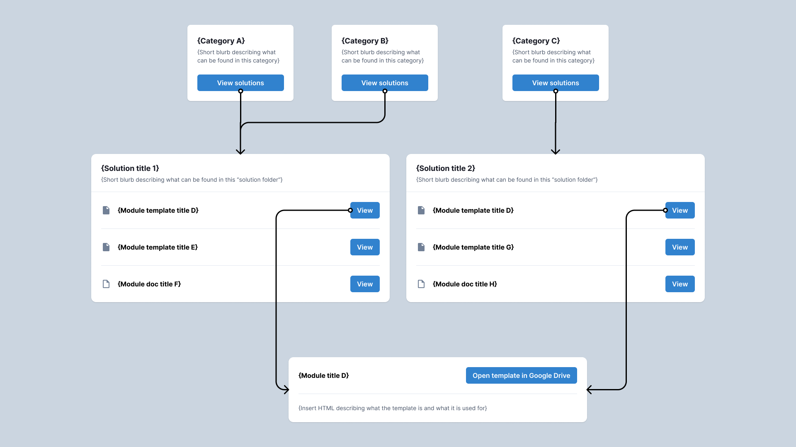

=== Library Content

Content is stored in a tree-like structure. Each piece of content can have a parent. If no parent is provided, the piece of content is considered a root pieace of content.

There are three categories of content available: `Modules`, `Solutions`, and `Categories`.

1. Modules are the foundational data-type of our Library. A module can be any of the following types:

* `Article` - content that is meant to be consumed as is; this is the content’s end state (e.g. a “how to” guide)
* `Template` - content that is meant to be taken and modified by users (e.g. a contract)

2. Modules are grouped together by a Solution.

3. Solutions are grouped together by a Category.

==== Query
Role requirement: `ROLE_OP_CO_USER`

Search and filter content.

The query parameter `q` will search across the following fields: `title`, `description`, `content`.

The query parameter `filter` works for the following fields: `type`.

You can `expand` and navigate the tree around a node by providing any of the following expand parameters

* `ancestors` - get all parent nodes to the root node
* `children` - get all immediate descendants of the node
* `descendants` - get all descendants (returns a subtree)

TIP: To get the whole tree of documents use the following query parameters `filter=type,CATEGORY` and `expand=descendants`. This filters the results to the top level elements and requests their subtrees.

operation::library-content/query[snippets='query-parameters,response-fields,http-request,http-response']

==== Get
Role requirement: `ROLE_OP_CO_USER`

Retrieving a document will include HTML you can render. The HTML is managed by an additional service hosted in AWS Lambda.

operation::library-content/get[snippets='response-fields,http-request,http-response']

==== Create
Role requirement: `ROLE_RH_ADMIN`

Create a piece of content.

If a `googleDriveId` is provided, the API will reach out to Google Drive and retrieve a  `text/plain` representation of the document requested. The API will then store that text document along with the payload provided in OpenSearch.

WARNING: All `googleDriveIds` must be shared with the following service account: `km-docs-svc@redesign-os.iam.gserviceaccount.com`

operation::library-content/create[snippets='response-fields,http-request,http-response']

==== Update

Role requirement: `ROLE_RH_ADMIN`

Update content in the Library.

NOTE: This will re-index content in OpenSearch.

NOTE: If the `parentId` changes, the child documents will also be updated accordingly.

operation::library-content/update[snippets='request-fields,response-fields,http-request,http-response']

==== Append Child

Role requirement: `ROLE_RH_ADMIN`

Move a piece of content under another parent.

NOTE: The first path parameter id is the `parent`.

operation::library-content/append-child[snippets='http-request,http-response']

==== Delete
Role requirement: `ROLE_RH_ADMIN`

Delete a piece of content.

Descendant nodes will be appended to the content's parent.

The content will also be removed from our search server.

operation::library-content/delete[snippets='http-request,http-response']
