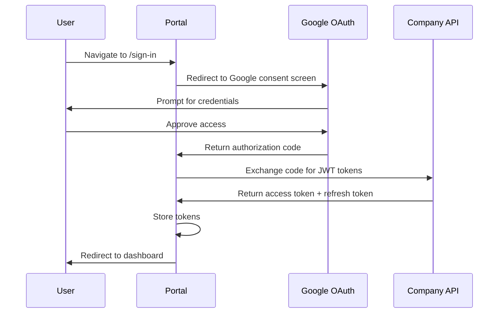

The Portal authenticates users via Google OAuth and manages JWT tokens for API communication with the Company API backend.

## Google OAuth flow



## Provider setup

The `GoogleOAuthProvider` wraps the entire application in `main.tsx`:

```tsx
<GoogleOAuthProvider clientId={GOOGLE_CLIENT_ID}>
  <QueryClientProvider client={directQueryClient()}>
    <RhProvider value={theme}>
      <App />
    </RhProvider>
  </QueryClientProvider>
</GoogleOAuthProvider>
```

The Google client ID is configured via the `VITE_GOOGLE_CLIENT_ID` environment variable.

## Token management

<AccordionGroup>
  <Accordion title="Token storage">
    After successful authentication, the Portal stores JWT tokens (access and refresh) for subsequent API requests. Tokens are managed through utilities in `@redesignhealth/portal/utils`.
  </Accordion>
  <Accordion title="Token refresh">
    When an access token expires, Axios interceptors automatically attempt to refresh it using the stored refresh token. If the refresh fails, the user is redirected to the sign-in page.
  </Accordion>
  <Accordion title="Logout">
    The `logout` utility from `@redesignhealth/portal/utils` clears stored tokens and redirects the user to the sign-in page. It is also passed to the `RootBoundary` error component for error recovery.
  </Accordion>
</AccordionGroup>

## Route protection

The dashboard layout route acts as an authentication guard by using a loader:

```tsx
<Route
  element={<Layout />}
  id="dashboard-layout"
  loader={async () => {
    return getUserInfo()
  }}
>
  {/* All protected routes */}
</Route>
```

The `getUserInfo()` loader from `@redesignhealth/portal/data-assets` fetches the current user's profile. If the request fails due to an invalid or missing token, the user is redirected to sign in.

## Role-based UI guards

The Portal supports role-based access control through a `hasRole` utility. Components can conditionally render UI elements based on the user's assigned roles:

```tsx
{hasRole(user, 'ADMIN') && <AdminPanel />}
```

<Warning>
  Role-based guards are UI-level only. The Company API enforces authorization on the backend. Never rely solely on frontend guards for security.
</Warning>

## Axios interceptors

API requests are made through Axios instances configured with interceptors that:

1. Attach the current access token to outgoing request headers
2. Intercept 401 responses to attempt token refresh
3. Retry the original request with the new token
4. Redirect to sign-in if the refresh also fails
