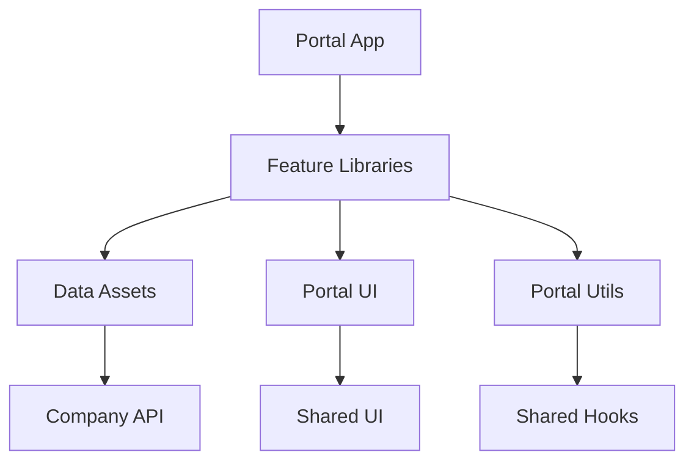

The Portal organizes components using a feature-sliced architecture where business logic lives in libraries and the application shell remains thin.

## Dependency flow



## Library organization

Portal libraries live under `libs/portal/` and are imported via path aliases:

| Library | Import path | Purpose |
|---|---|---|
| Features | `@redesignhealth/portal/features/*` | Feature modules with route components |
| Data assets | `@redesignhealth/portal/data-assets` | API clients, hooks, types |
| UI | `@redesignhealth/portal/ui` | Portal-specific UI components |
| Utils | `@redesignhealth/portal/utils` | Shared utilities |

## Feature modules

Each feature is a self-contained library with its own components, hooks, and tests:

```
libs/portal/features/companies/
├── src/
│   ├── lib/
│   │   ├── add-company/
│   │   │   ├── add-company.tsx
│   │   │   └── add-company.spec.tsx
│   │   ├── companies/
│   │   │   ├── companies.tsx
│   │   │   └── companies.spec.tsx
│   │   └── company-details/
│   │       ├── company-details.tsx
│   │       └── company-details.spec.tsx
│   └── index.ts           # Public API exports
├── project.json
└── tsconfig.json
```

<Note>
  Feature libraries export their public API through `src/index.ts`. Only import from the index — never reach into internal paths.
</Note>

## Naming conventions

The codebase enforces consistent naming through ESLint rules:

<AccordionGroup>
  <Accordion title="File naming: kebab-case">
    All files use kebab-case naming, enforced by `unicorn/filename-case`. For example: `add-company.tsx`, `company-details.spec.tsx`.
  </Accordion>
  <Accordion title="One component per file">
    The `react/no-multi-comp` rule (set to warn) encourages placing each component in its own file. This improves readability and makes components easier to locate.
  </Accordion>
  <Accordion title="Test co-location">
    Test files are co-located with their components using the `*.spec.tsx` suffix. For example, `companies.tsx` has a corresponding `companies.spec.tsx` in the same directory.
  </Accordion>
</AccordionGroup>

## Shared UI integration

Portal components build on top of the shared design system at `@redesignhealth/ui`:

```tsx
import { Loader, RootBoundary } from '@redesignhealth/ui'
```

The shared UI library provides foundational components (buttons, inputs, layout primitives, loaders) that are themed with Chakra UI v3. Portal-specific components in `@redesignhealth/portal/ui` extend these with domain-specific behavior.

## Component patterns

### Route components

Route components are thin wrappers that compose feature components with data fetching:

```tsx
// Located in apps/portal/src/routes/ or feature libraries
export function Companies() {
  return (
    <CompaniesLayout>
      <CompanyList />
      <Outlet />
    </CompaniesLayout>
  )
}
```

### Data-connected components

Components that need server data use React Query hooks from data-assets:

```tsx
import { useCompanies } from '@redesignhealth/portal/data-assets'

export function CompanyList() {
  const { data, isLoading } = useCompanies()
  if (isLoading) return <Loader />
  return <CompanyTable companies={data} />
}
```

### Presentational components

Pure UI components receive data through props and live in either `@redesignhealth/portal/ui` or `@redesignhealth/ui`:

```tsx
export function CompanyTable({ companies }: CompanyTableProps) {
  return (
    <Table>
      {companies.map(company => (
        <CompanyRow key={company.id} company={company} />
      ))}
    </Table>
  )
}
```

<Tip>
  When creating a new component, ask: does this belong in a feature library (domain-specific), the portal UI library (portal-wide reuse), or the shared UI library (cross-app reuse)?
</Tip>
