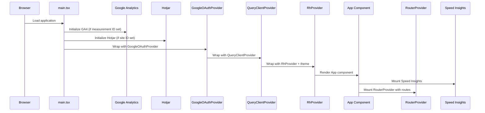

The Portal is the primary frontend application in the Redesign Health platform. It provides company management, IP marketplace, CEO directory, research hub, library, and vendor management capabilities for internal teams.

## Tech stack

| Layer | Technology |
|---|---|
| Framework | React 19 |
| Build tool | Vite |
| Routing | React Router v6 (data router) |
| UI library | Chakra UI v3 |
| Server state | TanStack React Query |
| Analytics | Google Analytics 4 (via react-ga4) + Hotjar |
| Performance | Vercel Speed Insights |
| Auth | Google OAuth (@react-oauth/google) |

## Application initialization

The Portal bootstraps through a well-defined sequence of providers and services:

## Key features

<AccordionGroup>
  <Accordion title="Company management">
    Create, edit, and manage portfolio companies. View company details including overview, users, IP listings, infrastructure, vendors, and expert network connections.
  </Accordion>
  <Accordion title="IP marketplace">
    Browse and manage intellectual property listings. Submit and track IP requests across the portfolio.
  </Accordion>
  <Accordion title="Research hub">
    Manage research sprints, call notes, and external content. Organize research activities across portfolio companies.
  </Accordion>
  <Accordion title="CEO directory">
    Maintain a directory of CEOs with onboarding workflows, profile management, and editing capabilities.
  </Accordion>
  <Accordion title="Library">
    Access solution libraries with modular content. Includes both a general library and a developer-specific library.
  </Accordion>
  <Accordion title="Vendor management">
    Track vendors across the portfolio. Add, edit, and associate vendors with specific companies.
  </Accordion>
</AccordionGroup>

## Feature-sliced architecture

The Portal follows a feature-sliced architecture where most business logic lives in libraries under `libs/portal/`:

- **features/** — Feature modules (companies, ceo-directory, ip-marketplace, research-hub, etc.)
- **data-assets** — API clients, React Query hooks, and TypeScript types
- **ui** — Portal-specific UI components
- **utils** — Shared portal utilities

<Tip>
  The Portal app itself is a thin shell. Approximately 80% of the code lives in `libs/portal/` libraries, following the Nx "library first" principle.
</Tip>
