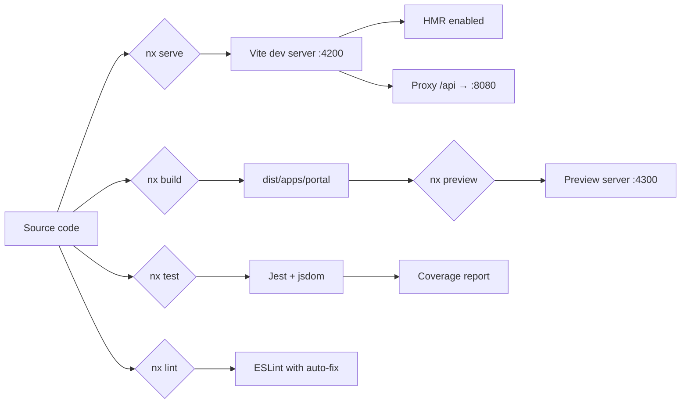

The Portal application lives at `apps/portal/` and is configured as an Nx project with Vite-based build and serve targets.

## Directory layout

```
apps/portal/
├── src/
│   ├── api/              # React Query client configuration
│   ├── app/              # Root App component
│   ├── assets/           # Static assets
│   ├── routes/           # Route components organized by feature
│   │   └── dashboard/    # Dashboard layout and nested routes
│   ├── shims/            # Compatibility shims (e.g., chakra-react-select)
│   ├── main.tsx          # Application entry point
│   ├── router.tsx        # Route definitions
│   └── polyfills.ts      # Browser polyfills
├── proxy.conf.json       # Dev server proxy configuration
├── vite.config.ts        # Vite configuration
├── jest.config.ts        # Test configuration
├── tsconfig.app.json     # App TypeScript config
├── tsconfig.spec.json    # Test TypeScript config
└── project.json          # Nx project configuration
```

## Nx project configuration

The Portal uses `@nx/vite` executors for building and serving:

<Tabs>
  <Tab title="Build">
    ```json
    {
      "build": {
        "executor": "@nx/vite:build",
        "outputs": ["{options.outputPath}"],
        "defaultConfiguration": "production",
        "options": {
          "outputPath": "dist/apps/portal"
        }
      }
    }
    ```

    Build output goes to `dist/apps/portal`. The production configuration enables optimization, output hashing, license extraction, and disables source maps.
  </Tab>
  <Tab title="Serve">
    ```json
    {
      "serve": {
        "executor": "@nx/vite:dev-server",
        "options": {
          "buildTarget": "portal:build",
          "hmr": true,
          "proxyConfig": "apps/portal/proxy.conf.json"
        }
      }
    }
    ```

    The dev server runs with hot module replacement enabled and proxies API requests.
  </Tab>
  <Tab title="Test">
    ```json
    {
      "test": {
        "executor": "@nx/jest:jest",
        "outputs": ["{workspaceRoot}/coverage/{projectRoot}"],
        "options": {
          "jestConfig": "apps/portal/jest.config.ts",
          "passWithNoTests": true
        }
      }
    }
    ```

    Tests run with Jest using a jsdom environment. CI mode enables `runInBand` and code coverage.
  </Tab>
</Tabs>

## Ports

| Environment | Port | Description |
|---|---|---|
| Development | 4200 | Vite dev server with HMR |
| Preview | 4300 | Vite preview server (production build) |

## API proxy

During development, API requests are proxied to the backend:

```json
{
  "/api": {
    "target": "http://localhost:8080",
    "secure": false
  }
}
```

All requests to `/api` are forwarded to a locally running instance of the Company API at `localhost:8080`.

## Vite configuration highlights

The Vite configuration includes several notable settings:

- **React plugin** — Uses `@vitejs/plugin-react` for JSX transforms and fast refresh
- **Nx TypeScript paths** — `nxViteTsPaths()` resolves workspace path aliases from `tsconfig.base.json`
- **chakra-react-select shim** — Redirects `chakra-react-select` imports to a compatibility shim for Chakra UI v3
- **Vitest** — Inline test configuration with jsdom environment and v8 coverage

## Build and development flow



## Available targets

| Target | Command | Description |
|---|---|---|
| `serve` | `nx serve portal` | Start dev server on port 4200 |
| `build` | `nx build portal` | Build for production |
| `preview` | `nx preview portal` | Preview production build on port 4300 |
| `test` | `nx test portal` | Run unit tests |
| `lint` | `nx lint portal --fix` | Lint with auto-fix |
| `check-types` | `nx check-types portal` | TypeScript type checking |
| `generate-company-api-client` | `nx generate-company-api-client portal` | Generate API client from dev OpenAPI spec |
| `generate-company-api-client-local` | `nx generate-company-api-client-local portal` | Generate API client from local OpenAPI spec |
| `build-image` | `nx build-image portal` | Build container image |
