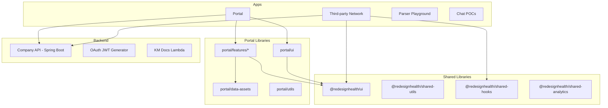
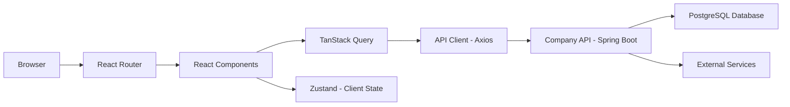
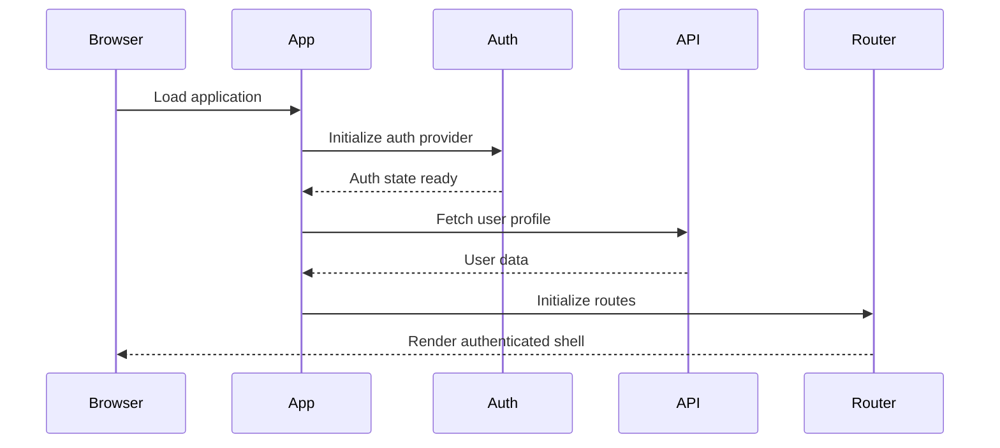

The Redesign Health platform follows a layered architecture with clear separation of concerns. This page covers the structural patterns, module boundaries, and design decisions that shape the codebase.

## Layered architecture

The platform organizes code into three primary layers:

- **Presentation layer** — React components, routing, and UI state. Lives in `apps/` and `libs/*/ui/` directories.
- **Business logic layer** — Feature modules, domain rules, and orchestration. Lives in `libs/*/features/` directories.
- **Data access layer** — API clients, TanStack Query hooks, and type definitions. Lives in `libs/*/data-assets/` directories.

Each layer only depends on the layer directly below it. Presentation depends on business logic, which depends on data access. Data access communicates with external services.

## Project structure

The Nx workspace splits code into applications (thin shells) and libraries (where most logic lives).

## System context

Requests flow from the browser through the React application layer, into TanStack Query for server state management, and out to the Company API backend.

## Portal initialization sequence

When the portal loads, it follows a defined initialization sequence to set up authentication, fetch configuration, and render the application shell.

## Nx workspace organization

All code lives in two top-level directories:

- **`apps/`** — Deployable applications. Each app is a thin shell that composes libraries.
- **`libs/`** — Shared and domain-specific libraries organized by scope.

Libraries follow a naming convention based on scope and type:

| Scope | Path pattern | Example |
| :--- | :--- | :--- |
| Shared | `libs/shared/<name>` | `libs/shared/ui`, `libs/shared/utils` |
| Portal | `libs/portal/<type>/<name>` | `libs/portal/features/companies` |
| Third-party network | `libs/third-party-network/<type>/<name>` | `libs/third-party-network/data-assets` |

All library imports use TypeScript path aliases defined in `tsconfig.base.json`. You never use relative paths to reference another library.

## Module boundaries

Nx enforces strict module boundaries through the `@nx/enforce-module-boundaries` ESLint rule. These constraints prevent architectural violations at lint time.

| Source scope | Can depend on |
| :--- | :--- |
| `scope:shared` | `scope:shared` only |
| `scope:portal` | `scope:portal`, `scope:shared`, `scope:rocketchat-poc` |
| `scope:oauth-jwt-generator` | `scope:oauth-jwt-generator`, `scope:shared` |

<Note>
  Module boundary violations fail the lint step in CI. Run `nx lint <project> --fix` to catch issues early.
</Note>

The boundary rules are defined in the root `.eslintrc.json` under the `@nx/enforce-module-boundaries` configuration. Tags are assigned to each project in its `project.json` file.

## Architectural patterns

The codebase applies several well-established patterns:

### Repository pattern

Data access libraries abstract API communication behind a consistent interface. Each domain entity (companies, users, advisors) has its own API client and TanStack Query hooks. Components never call APIs directly.

### Factory pattern

Code generators and Nx workspace generators use factory functions to produce consistent project scaffolding, API clients, and component templates.

### Observer pattern

TanStack Query implements the observer pattern for server state. Components subscribe to query keys and automatically re-render when data changes. Zustand provides a similar subscription model for client-side state.

### Composition pattern

UI components favor composition over inheritance. The shared UI library exposes primitive components that you combine to build complex interfaces. Feature modules compose data access hooks with presentation components.

## Cross-cutting concerns

### Authentication

Authentication flows through an auth provider that wraps the application. Protected routes use a `RequireAuth` wrapper component that redirects unauthenticated users. The auth state is available to any component through context.

### Monitoring and analytics

Analytics tracking is initialized at the application level and fires page view events using Helmet's `onChangeClientState` callback. This ensures dynamic document titles are captured after async data loads.

### Error handling

The platform uses error boundaries at the route level and TanStack Query's built-in error states at the data layer. Errors fail loudly — there are no silent catch blocks or fallback dummy data.

## Architectural decision records

Key architectural decisions are documented below for context on why certain technologies and patterns were chosen.

<AccordionGroup>
  <Accordion title="Java + Spring Boot for the backend">
    The Company API uses Java 17 with Spring Boot. This choice provides mature ecosystem support for enterprise patterns, strong typing, and broad team familiarity. Spring Boot's auto-configuration and starter dependencies reduce boilerplate for REST APIs, security, and data access.
  </Accordion>
  <Accordion title="ORM and data access strategy">
    The backend uses Spring Data JPA with Hibernate as the ORM. This provides repository abstractions, query derivation from method names, and transaction management. Complex queries use native SQL or JPQL where the abstraction adds unnecessary overhead.
  </Accordion>
  <Accordion title="Multi-module Nx monorepo">
    The decision to use a single Nx monorepo (rather than polyrepo) enables shared tooling, atomic cross-project changes, and enforced module boundaries. Nx Cloud provides distributed caching so that CI times remain fast as the codebase grows.
  </Accordion>
  <Accordion title="Chakra UI v3 design system">
    The shared UI library is built on Chakra UI v3, migrated from v2. Chakra provides accessible, composable primitives with a token-based theme system. The v3 migration introduced breaking changes to props and component APIs, documented in the shared libraries page.
  </Accordion>
</AccordionGroup>
