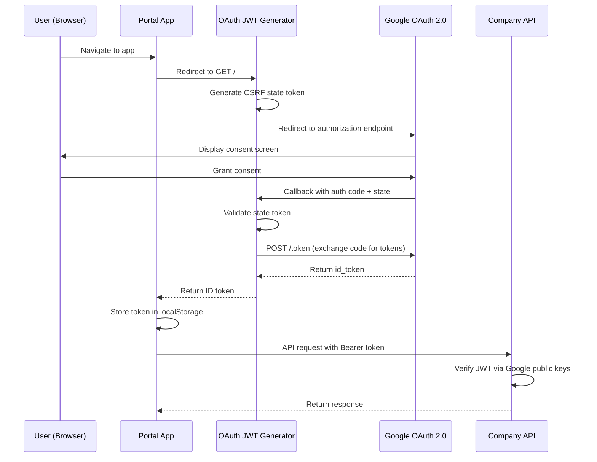
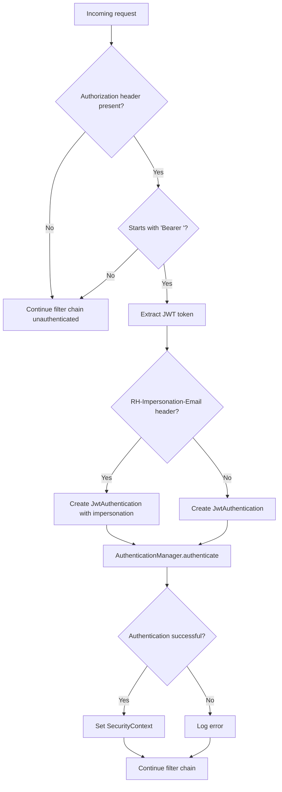
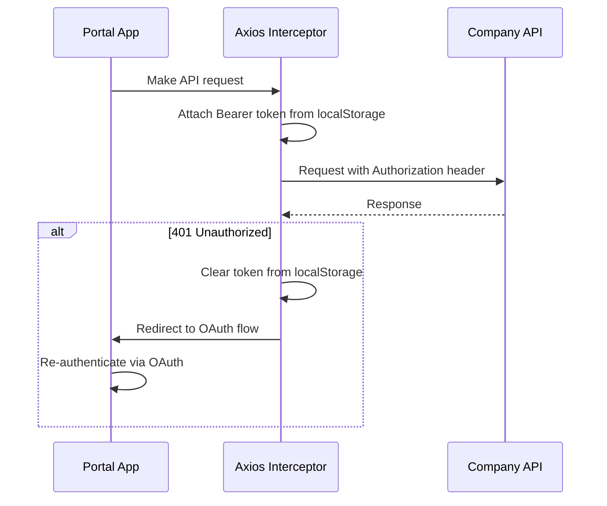
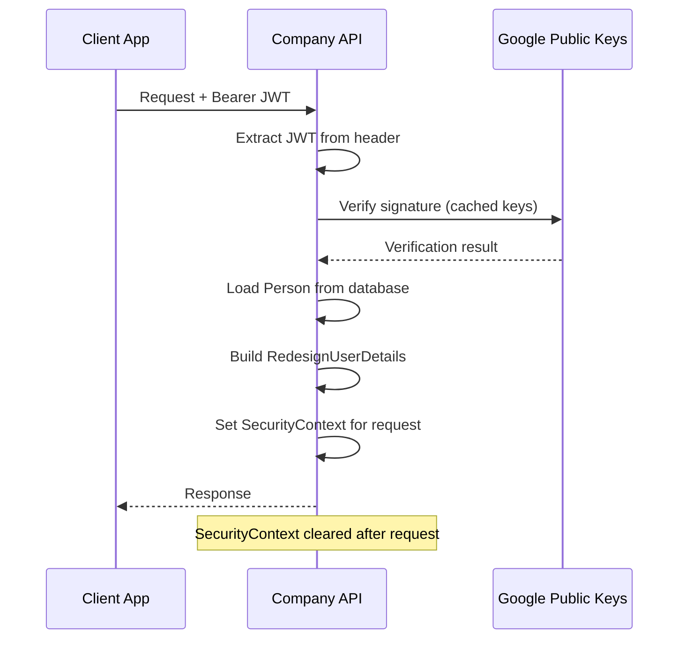

## Overview

The Redesign Health platform uses **Google OAuth 2.0** for identity verification and **JWT-based authentication** for API access. The Company API enforces role-based access control (RBAC) through a custom Spring Security filter chain, while frontend clients manage tokens via localStorage and Axios interceptors.

## Google OAuth integration

Users authenticate through Google's OAuth 2.0 authorization flow. The OAuth JWT Generator service handles the browser-based redirect flow and returns a Google ID token that serves as the bearer token for all subsequent API requests.



<Note>
  The OAuth JWT Generator validates the CSRF `state` parameter on every callback. If the state does not match the value generated at the start of the flow, the request is rejected with a mismatch error.
</Note>

## JWT verification

The Company API verifies Google ID tokens on every authenticated request using Google's public key infrastructure.

### JwtService interface

The `JwtService` interface defines the contract for JWT verification:

```java
public interface JwtService {
    /**
     * Verify token and return JWT payload.
     * Returns Optional.empty() if verification failed.
     */
    Optional<Map<String, Object>> verify(JwtRef jwt);
}
```

### GoogleJwtService implementation

`GoogleJwtService` implements `JwtService` using Google's `GoogleIdTokenVerifier`. It verifies the token signature, expiration, audience, and issuer claims according to [Google's verification requirements](https://developers.google.com/identity/gsi/web/guides/verify-google-id-token).

```java
public class GoogleJwtService implements JwtService {
    private final GoogleIdTokenVerifier verifier;

    public Optional<Map<String, Object>> verify(JwtRef jwt) {
        var idToken = verifier.verify(jwt.value());
        if (null == idToken) {
            return Optional.empty();
        }
        return Optional.of(idToken.getPayload());
    }
}
```

<Warning>
  If the token fails verification (expired, invalid signature, wrong audience), the method returns `Optional.empty()` and the request proceeds without authentication context. Protected endpoints will then return 401 Unauthorized.
</Warning>

## Security filter chain

The Company API uses a custom Spring Security configuration with stateless session management and a JWT authentication filter.

### SecurityConfig

The `SecurityConfig` class defines the filter chain:

- **Stateless sessions** -- No server-side session state (`SessionCreationPolicy.STATELESS`)
- **CSRF disabled** -- Not needed for stateless JWT authentication
- **CORS configured** -- Allowed origins, methods, and headers loaded from application properties
- **Public endpoints** -- `/public/**`, `/`, `/actuator/**`, and `/error/**` are unauthenticated
- **Admin endpoints** -- `/admin/**` requires `ROLE_SUPER_ADMIN`
- **All other endpoints** -- Require authentication

### RedesignAuthenticationFilter

The `RedesignAuthenticationFilter` extends `OncePerRequestFilter` and intercepts every request to extract and verify the JWT:



<Tabs>
  <Tab title="Standard flow">
    The filter extracts the bearer token from the `Authorization` header, creates a `JwtAuthentication` object, and delegates to the `AuthenticationManager` for verification.
  </Tab>
  <Tab title="Impersonation flow">
    Super admins can impersonate other users by including the `RH-Impersonation-Email` header. The filter passes this to the authentication manager, which resolves the impersonated user's roles and company memberships.
  </Tab>
</Tabs>

## Role-based access control

### RoleAuthority enum

The platform defines five hierarchical roles:

| Role | Level | Display name |
| :--- | :---: | :--- |
| `ROLE_SUPER_ADMIN` | 5 | Super Admin |
| `ROLE_RH_ADMIN` | 4 | Admin |
| `ROLE_RH_USER` | 3 | RH User |
| `ROLE_OP_CO_USER` | 2 | Company User |
| `ROLE_OP_CO_CONTRACTOR` | 1 | Company Contractor |

Roles are hierarchical -- a higher-level role automatically has all permissions of lower-level roles. The `hasPermissionsOf` method on `RoleAuthority` compares inheritance order values to determine access.

### AuthChecks utility

The `AuthChecks` class provides static helper methods for authorization checks throughout the application:

| Method | Description |
| :--- | :--- |
| `getPrincipal()` | Returns the authenticated `RedesignUserDetails` from the security context |
| `isAdmin(auth)` | Returns `true` if the user has `ROLE_RH_ADMIN` or higher |
| `hasRole(role)` | Returns `true` if the user has the exact specified role |
| `hasRoleOrHigher(auth, role)` | Returns `true` if the user's role has permissions of the specified role |
| `isMember(auth, apiId, role)` | Returns `true` if the user is a member of the specified company (admins are members of all companies) |

### RedesignUserDetails

The `RedesignUserDetails` class implements Spring Security's `UserDetails` interface and holds:

- **Username** -- The user's email address (as `PersonRef`)
- **Roles** -- A set of `GrantedAuthority` derived from the user's `RoleAuthority`
- **Company memberships** -- A set of `CompanyRef` for companies where the user has `ACTIVE` membership status
- **Metadata** -- A map for additional context attached during authentication

### RoleController API

The `RoleController` exposes two endpoints for role management:

| Method | Path | Description |
| :--- | :--- | :--- |
| `GET` | `/role` | Returns all available roles |
| `GET` | `/me/role` | Returns roles the current user can assign to others |

<Note>
  The `/me/role` endpoint filters out `ROLE_SUPER_ADMIN` for non-super-admin users and always excludes `ROLE_OP_CO_CONTRACTOR` from the assignable list.
</Note>

## Frontend token management

### Token storage and refresh

The Portal application stores the Google ID token in `localStorage` after the OAuth flow completes. An Axios request interceptor attaches the token to every API request as a `Bearer` token in the `Authorization` header.



### UI role guards

The Portal uses a `hasRole` utility function to conditionally render UI elements based on the current user's role. This provides client-side gating but does not replace server-side authorization -- the Company API always enforces role checks on every request.

<Warning>
  Client-side role checks are for UX convenience only. Never rely on frontend guards as a security boundary. The Company API enforces all authorization rules server-side.
</Warning>

## Session handling

The platform uses stateless authentication -- there are no server-side sessions. Each request is independently authenticated via the JWT in the `Authorization` header.



<Tip>
  Google's public keys are cached by the `GoogleIdTokenVerifier`. You do not need to manage key rotation manually -- the verifier handles this automatically.
</Tip>

## Healthcare compliance considerations

<AccordionGroup>
  <Accordion title="Data in transit">
    All API communication uses HTTPS/TLS encryption. The Company API enforces HTTPS in non-local environments through infrastructure configuration (load balancers, reverse proxies).
  </Accordion>
  <Accordion title="Stateless authentication">
    The stateless JWT model avoids server-side session storage, reducing the attack surface for session hijacking. Tokens have a limited lifetime enforced by Google's token expiration.
  </Accordion>
  <Accordion title="Impersonation audit trail">
    When a super admin uses the `RH-Impersonation-Email` header, the original admin's identity is preserved in the authentication context for audit logging purposes.
  </Accordion>
  <Accordion title="Principle of least privilege">
    The hierarchical role model ensures users only have access to the minimum resources needed. Company-level membership checks further restrict data access to relevant company members.
  </Accordion>
</AccordionGroup>
