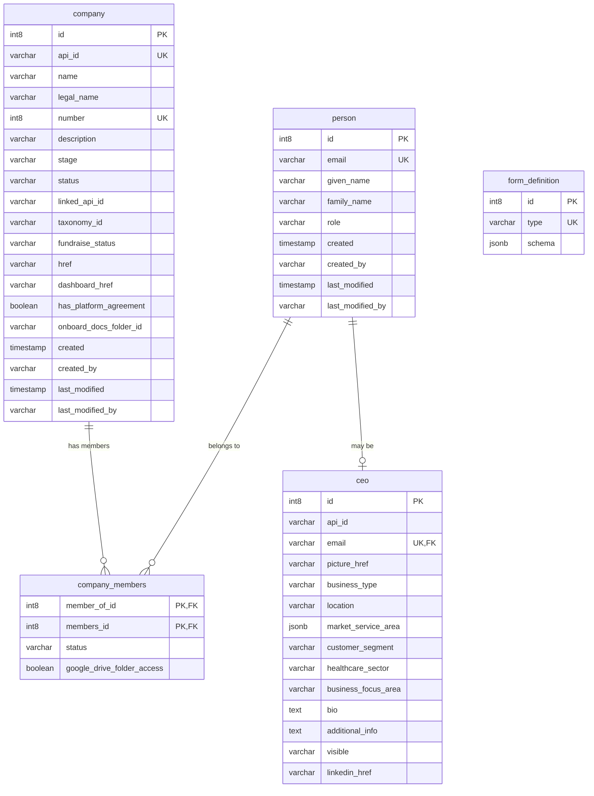
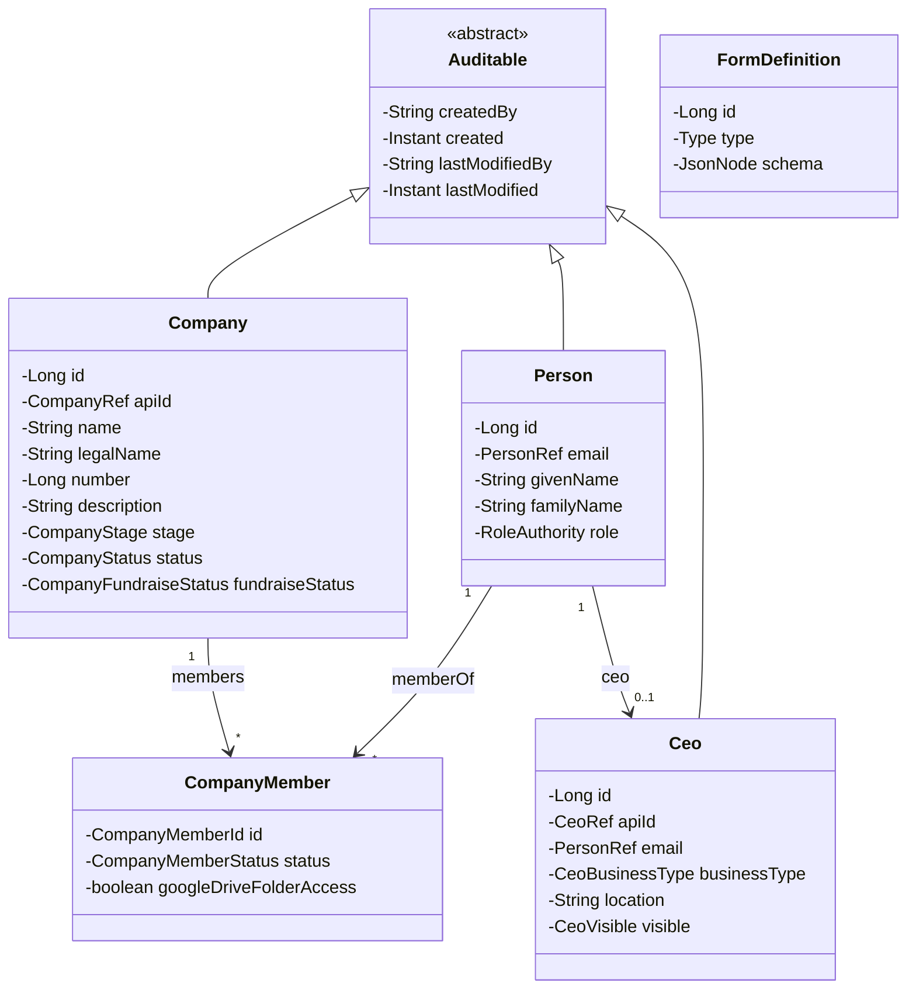
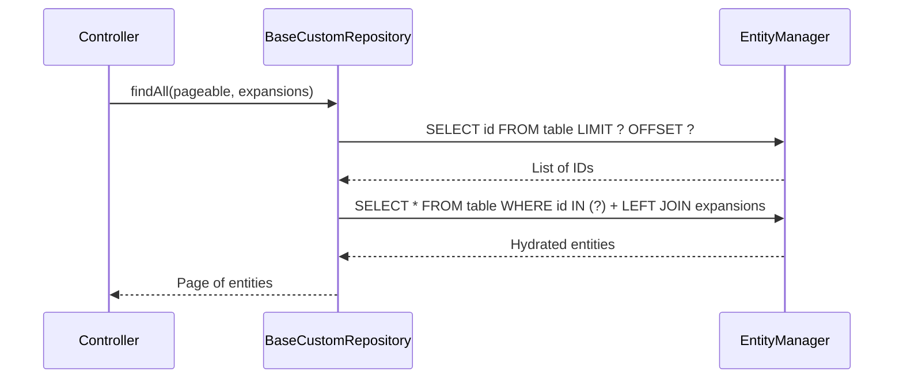

## Overview

The Company API uses **CockroachDB** as its primary database (PostgreSQL-compatible), **Flyway** for schema migrations, and **Spring Data JPA with Hibernate** as the ORM layer. This page covers the database schema design, migration strategy, repository patterns, and data validation approach.

## Database schema

The core schema revolves around companies, people, and their memberships. The initial migration establishes the foundational tables, with subsequent migrations adding fields, relationships, and new entities.



## Flyway migration strategy

All schema changes are managed through versioned Flyway SQL migration files stored in `apps/company-api/application/src/main/resources/db/migration/`.

### Naming convention

Migrations follow the pattern:

```
V<timestamp>__<description>.sql
```

For example:
- `V202209261654__init.sql` -- Initial schema
- `V202302011238__replace_opco_with_company.sql` -- Rename operating company to company
- `V202306231027__create_vendor_entity.sql` -- Add vendor table

<Note>
  The timestamp format is `YYYYMMDDHHmm`. Use the current date and time when creating new migrations to ensure correct ordering.
</Note>

### Migration history

The platform has evolved through many migrations, starting with the initial schema:

```sql
-- V202209261654__init.sql
CREATE TABLE operating_company (
    id int8,
    name varchar(255),
    slug varchar(255) NOT NULL,
    PRIMARY KEY(id),
    UNIQUE(slug)
);

CREATE TABLE person (
    id int8,
    email varchar(255) NOT NULL,
    family_name varchar(255),
    given_name varchar(255),
    PRIMARY KEY (id),
    UNIQUE (email)
);

CREATE TABLE operating_company_members (
    member_of_id int8 REFERENCES operating_company,
    members_id int8 REFERENCES person,
    PRIMARY KEY (member_of_id, members_id)
);

CREATE SEQUENCE hibernate_sequence START 1 INCREMENT 1;
```

<Steps>
  <Step title="Initial schema (2022-09)">
    Created `operating_company`, `person`, and `operating_company_members` tables with basic fields and a shared Hibernate sequence.
  </Step>
  <Step title="Roles and audit (2022-09 to 2022-10)">
    Added `role` to `person`, audit fields (`created`, `created_by`, `last_modified`, `last_modified_by`), and additional company fields.
  </Step>
  <Step title="Company rename (2023-02)">
    Renamed `operating_company` to `company` and updated all role names to use `COMPANY` prefix instead of `OP_CO`.
  </Step>
  <Step title="Form definitions (2023-02)">
    Created `form_definition` table with JSONB schema storage for dynamic forms like tech stack and privacy questionnaire.
  </Step>
  <Step title="Vendors and taxonomy (2023-06 to 2023-10)">
    Introduced vendor management, company taxonomy, categories, subcategories, and the IP marketplace entity hierarchy.
  </Step>
  <Step title="CEO directory (2023-08)">
    Added the `ceo` entity with business focus areas, healthcare sectors, customer segments, and visibility controls.
  </Step>
</Steps>

## Entity relationships

### Core entities



### Auditable base class

All core entities extend the `Auditable` mapped superclass, which automatically tracks creation and modification metadata:

| Field | Type | Description |
| :--- | :--- | :--- |
| `createdBy` | `String` | Email of the user who created the record |
| `created` | `Instant` | Timestamp of creation |
| `lastModifiedBy` | `String` | Email of the last modifier |
| `lastModified` | `Instant` | Timestamp of last modification |

<Tip>
  Audit fields are populated automatically by Spring Data JPA's `AuditingEntityListener`. The current user is resolved from the Spring Security context via a custom `AuditorAware` implementation.
</Tip>

## Spring Data JPA repository pattern

### Standard repositories

Most entities use Spring Data JPA's `JpaRepository` interface for standard CRUD operations:

- `CompanyRepository`
- `PersonRepository`
- `VendorRepository`
- `CeoRepository`
- `FormDefinitionRepository`
- `CompanyMemberRepository`
- `ConsentRepository`

### BaseCustomRepository

For entities that require expansion-aware pagination, the `BaseCustomRepository` provides a custom implementation inspired by Spring Data's `SimpleJpaRepository`:



The two-query approach solves Hibernate's limitation with paginating and hydrating (eagerly fetching) associations at the same time:

1. **ID query** -- Retrieves paginated entity IDs without hydrating relationships
2. **Hydration query** -- Fetches full entities with requested expansions using `LEFT JOIN FETCH`

<Note>
  Use the `Expansion` parameter to control which lazy-loaded associations are hydrated. Requesting an unsupported expansion throws an `UnsupportedExpansionException`.
</Note>

## Typed natural keys with Ref class hierarchy

The Company API uses typed wrappers for natural keys instead of raw strings. The abstract `Ref` class provides the foundation:

```java
public abstract class Ref {
    public static final String DEFAULT_REF_COLUMN_NAME = "apiId";
    public abstract String value();
}
```

Concrete implementations include:

| Ref type | Column | Example value |
| :--- | :--- | :--- |
| `CompanyRef` | `apiId` | `pip-care` |
| `PersonRef` | `email` | `user@redesignhealth.com` |
| `CeoRef` | `apiId` | `ceo-abc123` |

<Tip>
  Ref types use JPA `AttributeConverter` classes (e.g., `CompanyRefConverter`, `PersonRefConverter`) to serialize and deserialize between the Java object and the database column.
</Tip>

## Data validation

### FieldErrorType enum

The API uses a structured validation system with typed error categories:

| Error type | Description |
| :--- | :--- |
| `UNIQUE` | Must be unique |
| `NOT_NULL` | Must not be null |
| `EXISTS` | Must exist |
| `INVALID_REFERENCE` | Must not reference itself |
| `NOT_EMPTY` | Must not be empty |
| `NOT_BLANK` | Must not be blank |
| `NOT_BELONG` | Child does not belong to parent |
| `CONTAINS_REPORT_URL` | Must contain `report_url` |

Validation errors are returned as structured `ApiFieldError` responses with the HTTP status `422 Unprocessable Entity`.

## Referential integrity

The database enforces referential integrity through:

- **Foreign keys** -- All relationship columns reference parent tables with foreign key constraints
- **Cascading deletes** -- Added progressively through migrations (e.g., `V202212071113__add_cascade_on_delete_for_op_co.sql`) to handle cleanup when parent entities are deleted
- **Unique constraints** -- Applied to natural keys like `api_id`, `email`, and `company.number`
- **Composite primary keys** -- Used for join tables like `company_members` (`member_of_id`, `members_id`)

## Pooled sequences

The initial schema uses a single shared Hibernate sequence. Later migrations introduced entity-specific pooled sequences for better concurrent performance:

```sql
-- V202301251643__update_sequences.sql
-- Updates sequences to use pooled allocation for reduced contention
```

<Note>
  CockroachDB handles sequences differently from PostgreSQL in some edge cases. The `SERIALIZABLE` isolation level means some transactions may receive a `RETRY_SERIALIZABLE` error and need client-side retry logic.
</Note>

## Architectural decisions

<AccordionGroup>
  <Accordion title="Why Flyway for migrations?">
    Flyway provides version-controlled, repeatable schema migrations that run automatically on application startup. This ensures every environment has the same schema without manual intervention.
  </Accordion>
  <Accordion title="Why Spring Data JPA and Hibernate?">
    Spring Data JPA reduces boilerplate for CRUD operations while Hibernate handles the ORM mapping. The custom `BaseCustomRepository` extends this for cases where Spring Data's default pagination does not support expansion/hydration patterns.
  </Accordion>
  <Accordion title="Why typed natural keys (Ref classes)?">
    Wrapping identifiers in typed classes prevents mixing up different ID types at compile time (e.g., passing a `PersonRef` where a `CompanyRef` is expected). It also centralizes column name mapping and conversion logic.
  </Accordion>
  <Accordion title="Why pooled sequences?">
    Pooled sequence allocation reduces the number of database round-trips needed to generate IDs, improving throughput under concurrent writes. This is especially important with CockroachDB's distributed architecture.
  </Accordion>
  <Accordion title="Why enums stored as strings?">
    Migration `V202302161043__update_enums_to_strings.sql` converted enum columns from ordinal to string storage. String-based enums are more readable in queries, safer during refactoring (reordering values does not break data), and easier to debug.
  </Accordion>
</AccordionGroup>

## Troubleshooting

<AccordionGroup>
  <Accordion title="Flyway migration fails on startup">
    Check that no migration file has been modified after being applied. Flyway checksums each migration -- if the checksum does not match the recorded value in the `flyway_schema_history` table, startup will fail. You may need to run `flyway repair` or restore the original migration file.
  </Accordion>
  <Accordion title="RETRY_SERIALIZABLE errors">
    CockroachDB's `SERIALIZABLE` isolation can produce transaction retry errors under contention. The `GlobalExceptionHandler` returns HTTP 429 (Too Many Requests) for these. Implement retry logic on the client side with exponential backoff.
  </Accordion>
  <Accordion title="UnsupportedExpansionException">
    This occurs when a client requests an expansion that is not in the repository's `validExpansions` set. Check the specific repository class to see which expansions are supported.
  </Accordion>
  <Accordion title="Sequence conflicts after data import">
    If you import data with IDs that overlap with the current sequence value, subsequent inserts may fail with duplicate key errors. Reset the sequence to a value higher than the maximum existing ID.
  </Accordion>
</AccordionGroup>
