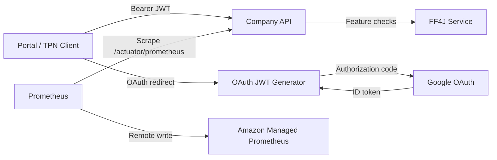
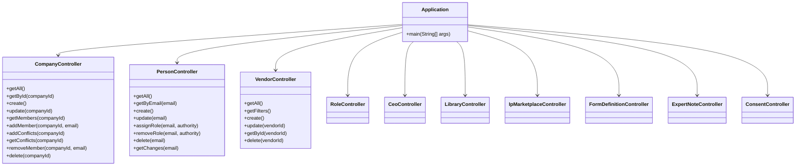
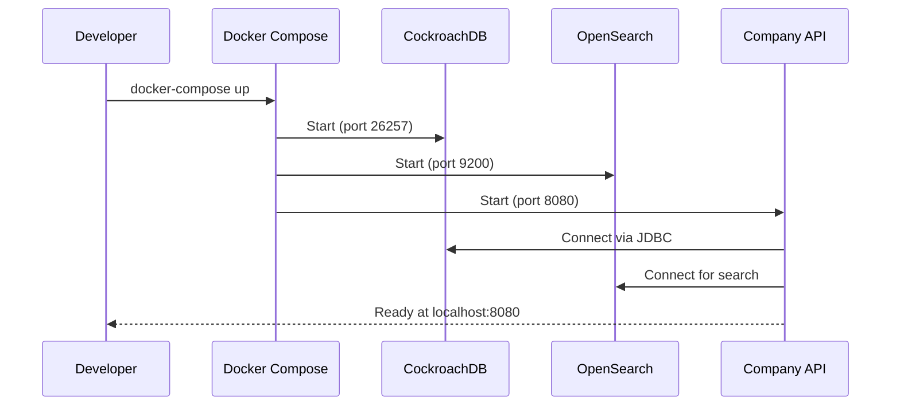
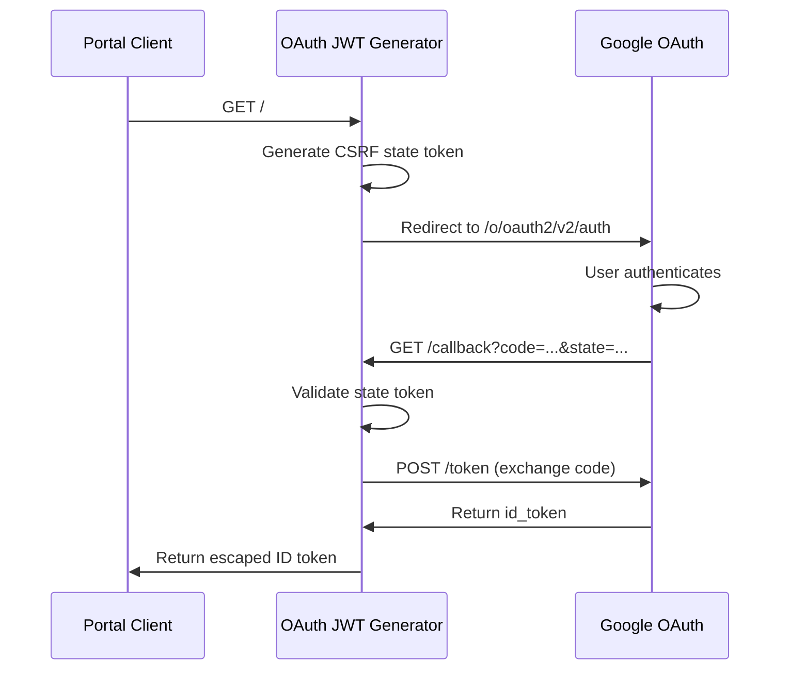

## Overview

The Redesign Health platform backend is composed of several microservices that handle company management, authentication, feature flagging, and observability. Each service is independently deployable and communicates through REST APIs.



## Company API

The Company API is the primary backend service, built with **Spring Boot** and structured as a multi-module Maven project. It provides REST endpoints for managing companies, vendors, people, and related resources.

### Project structure

The Company API uses a multi-module Maven layout:

```
apps/company-api/
  pom.xml                   # Parent POM (packaging: pom)
  application/              # Main Spring Boot application module
    pom.xml
    src/main/java/...       # Controllers, services, entities, security
    src/main/resources/     # Application config, Flyway migrations
    src/test/java/...       # Unit and integration tests
  jira-rest-client/         # Jira REST client module
    pom.xml
```

<Note>
  The parent POM coordinates are `com.redesignhealth:company-api-parent`. Both the `application` and `jira-rest-client` modules inherit from this parent.
</Note>

### Key controllers



### Spring profiles

The Company API uses Spring profiles to configure behavior per environment:

| Profile | Purpose |
| :--- | :--- |
| `docker-compose` | Local development with containerized dependencies |
| `dev` | Development environment (AWS-hosted) |
| `staging` | Pre-production environment |
| `prod` | Production environment |

<Tip>
  Set the active profile through the `SPRING_PROFILES_ACTIVE` environment variable. The Docker Compose configuration defaults to `docker-compose`.
</Tip>

### Prometheus metrics

The Company API exposes metrics at `/actuator/prometheus` via Spring Boot Actuator. Prometheus scrapes this endpoint on a configurable interval to collect JVM, HTTP, and custom application metrics.

### Local development with Docker Compose

The `docker-compose.yml` in `apps/company-api/` defines the full local development stack:



<CodeGroup>

```bash Start the stack
docker-compose up
```

```bash Start with rebuild
docker-compose up --build
```

```bash Stop and clean volumes
docker-compose down -v
```

</CodeGroup>

**Services in the stack:**

| Service | Image | Port | Purpose |
| :--- | :--- | :--- | :--- |
| `company-api` | Local build | 8080 | Application server |
| `cockroachdb` | `cockroachdb/cockroach:v22.2.6` | 26257, 8081 | Primary database |
| `opensearch` | `opensearchproject/opensearch:latest` | 9200 | Full-text search engine |

<Warning>
  The Docker Compose file also includes RocketChat and MongoDB services for legacy chat integration. These are not required for Portal or Third-Party Network development and can be commented out to reduce resource consumption.
</Warning>

## OAuth JWT generator

The OAuth JWT generator is a lightweight **Express.js** service that exchanges Google OAuth authorization codes for ID tokens. The portal and other frontend clients redirect users to this service to obtain JWTs for API authentication.



### Configuration

| Environment variable | Description |
| :--- | :--- |
| `PORT` | Server port (default: `3000`) |
| `OAUTH_JWT_CLIENT_ID` | Google OAuth client ID |
| `OAUTH_JWT_CLIENT_SECRET` | Google OAuth client secret |

### Endpoints

| Method | Path | Description |
| :--- | :--- | :--- |
| `GET` | `/` | Initiates OAuth flow, redirects to Google |
| `GET` | `/callback` | Handles OAuth callback, returns ID token |
| `GET` | `/health` | Health check endpoint |

<Note>
  The generator uses a CSRF state token (generated via `crypto.randomUUID()`) to prevent cross-site request forgery during the OAuth flow. The callback handler validates the state parameter before exchanging the authorization code.
</Note>

## FF4J feature flag service

The FF4J service provides runtime feature flag management for the platform. It is built with **Spring Boot** and the **FF4J** library, exposing a web console and REST API for managing feature toggles.

### Key components

- **`Ff4jRhApplication`** -- Standard Spring Boot application entry point
- **`FF4jConfig`** -- Configures the FF4J bean and feature store
- **`FF4jService`** -- Service layer for feature flag operations
- **`CorsConfig`** -- CORS configuration for cross-origin access from frontend clients

### Running the service

The FF4J service runs as a standalone Spring Boot application. It uses Spring Boot Actuator for health checks and monitoring.

```bash
cd apps/ff4j-rh
./mvnw spring-boot:run
```

## Prometheus

Prometheus provides containerized monitoring for the platform. It scrapes metrics from the Company API and other services, then forwards them to Amazon Managed Prometheus via remote write.

### Configuration

The Prometheus setup uses a template-based configuration (`prometheus-template.yml`) with environment-specific variable substitution:

```yaml
global:
  scrape_interval: 15s
  external_labels:
    monitor: 'prometheus'

scrape_configs:
  - job_name: 'prometheus'
    scrape_interval: 5s
    static_configs:
      - targets: ['localhost:9090']
  - job_name: 'company-api'
    metrics_path: '/actuator/prometheus'
    static_configs:
      - targets: ['{{COMPANY_API_HOSTNAME}}']

remote_write:
  - url: '{{REMOTE_WRITE_PROMETHEUS_URL}}'
    sigv4:
      region: us-east-1
```

### Environment scripts

Environment-specific scripts in `apps/prometheus/scripts/` generate the final configuration by substituting template variables:

| Script | Target environment |
| :--- | :--- |
| `dev.sh` | Development |
| `staging.sh` | Staging |
| `prod.sh` | Production |
| `core.sh` | Shared configuration logic |
| `generate-config.sh` | Template processor |

<Tip>
  The Prometheus container uses SigV4 authentication to write metrics to Amazon Managed Prometheus. Make sure your AWS credentials are configured in the deployment environment.
</Tip>
