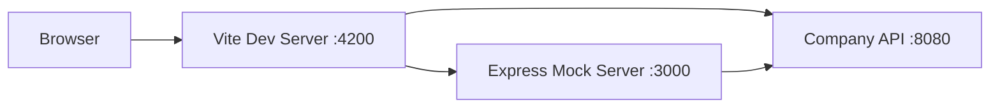

This guide walks you through cloning, installing, and running the Redesign Health platform on your local machine.

## Prerequisites

Before you begin, make sure you have the following installed:

| Tool | Version | Notes |
| :--- | :--- | :--- |
| Node.js | >= 18.17.1 | Use [nvm](https://github.com/nvm-sh/nvm) for version management |
| npm | >= 9.6.7 | Ships with Node.js |
| Git | Latest | Required for cloning and version control |
| Docker | Latest | Only required if using the devcontainer |

<Note>
  This monorepo uses `--legacy-peer-deps` for package installation. The npm scripts handle this automatically, but keep it in mind if you install packages manually.
</Note>

## Installation

<Steps>
  <Step title="Clone the repository">
    ```bash
    git clone https://github.com/ArdentHQ/rh-nx-monorepo.git
    cd rh-nx-monorepo
    ```
  </Step>
  <Step title="Install dependencies">
    Install all packages from the repository root. Do not install inside individual apps or libraries.

    ```bash
    npm install --legacy-peer-deps
    ```
  </Step>
  <Step title="Configure environment variables">
    Create a `.env` file in the project root or configure the required variables for the application you want to run.

    ```bash
    # Portal environment variables
    VITE_API_BASE_URL=http://localhost:8080
    VITE_AUTH_DOMAIN=your-auth-domain
    VITE_AUTH_CLIENT_ID=your-client-id
    VITE_AUTH_AUDIENCE=your-audience
    ```

    <Warning>
      Never commit `.env` files to version control. The repository `.gitignore` already excludes them.
    </Warning>
  </Step>
  <Step title="Start the development server">
    ```bash
    npm start
    ```

    The portal application starts on [http://localhost:4200](http://localhost:4200) by default.
  </Step>
</Steps>

## Architecture overview

The local development setup routes requests through a Vite dev server that proxies API calls to either the Express mock server or the live Company API.



## Essential commands

| Action | Command |
| :--- | :--- |
| Start portal | `npm start` |
| Build portal | `npm run build:portal` |
| Run all tests | `npm test` |
| Run affected tests | `npm run affected:test` |
| Lint with auto-fix | `npm run lint` |
| Format code | `npm run format:write` |
| Type check all projects | `npm run check-types:all` |
| View dependency graph | `npm run graph` |
| Run Storybook | `npm run storybook` |
| Generate Chakra theme types | `npm run theme` |

<Tip>
  Use `nx affected` commands to only build, test, or lint the projects impacted by your changes. This dramatically speeds up feedback loops.
</Tip>

## VS Code setup

For the best development experience, configure VS Code with the following:

1. **Install recommended extensions.** Open the command palette and run `Extensions: Show Recommended Extensions`. The repository defines these in `.vscode/extensions.json`.

2. **Install Nx Console.** This provides a visual interface for running Nx tasks, exploring the project graph, and generating code.

3. **Select the workspace TypeScript version.** Open any `.ts` file, then run `TypeScript: Select TypeScript Version` from the command palette. Choose **Use Workspace Version** (TypeScript 5.1.6).

<Warning>
  Using the VS Code bundled TypeScript version instead of the workspace version can cause false type errors and inconsistent behavior with the CI pipeline.
</Warning>

## Devcontainer setup

The repository includes a devcontainer configuration for Docker-based development. This provides a consistent, pre-configured environment.

<Steps>
  <Step title="Install Docker Desktop">
    Download and install [Docker Desktop](https://www.docker.com/products/docker-desktop/) for your operating system.
  </Step>
  <Step title="Install the Dev Containers extension">
    In VS Code, install the **Dev Containers** extension (`ms-vscode-remote.remote-containers`).
  </Step>
  <Step title="Reopen in container">
    Open the command palette and run `Dev Containers: Reopen in Container`. VS Code rebuilds and connects to the container automatically.
  </Step>
</Steps>

## Troubleshooting

<AccordionGroup>
  <Accordion title="npm install fails with peer dependency errors">
    Always use the `--legacy-peer-deps` flag:

    ```bash
    npm install --legacy-peer-deps
    ```

    This is required because some packages in the monorepo have conflicting peer dependency ranges.
  </Accordion>
  <Accordion title="Port 4200 is already in use">
    Another process is occupying the default dev server port. Find and kill it:

    ```bash
    lsof -i :4200
    kill -9 <PID>
    ```

    Alternatively, start the dev server on a different port:

    ```bash
    nx serve portal --port=4201
    ```
  </Accordion>
  <Accordion title="TypeScript errors not matching CI">
    Make sure you have selected the workspace TypeScript version in VS Code. Open any `.ts` file, press `Cmd+Shift+P`, and run `TypeScript: Select TypeScript Version` then choose **Use Workspace Version**.
  </Accordion>
  <Accordion title="Nx cache issues causing stale builds">
    Clear the Nx cache and rebuild:

    ```bash
    nx reset
    npm run build:portal
    ```
  </Accordion>
  <Accordion title="Docker container fails to start">
    Ensure Docker Desktop is running and has sufficient resources allocated (at least 4 GB RAM). Try rebuilding the container:

    ```bash
    # From VS Code command palette
    Dev Containers: Rebuild Container
    ```
  </Accordion>
</AccordionGroup>
