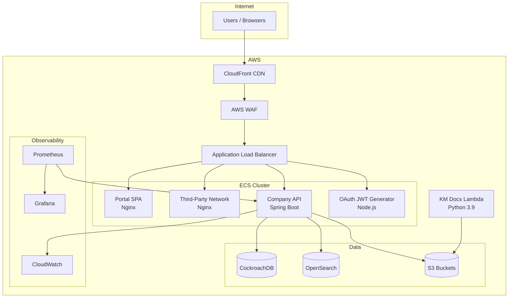
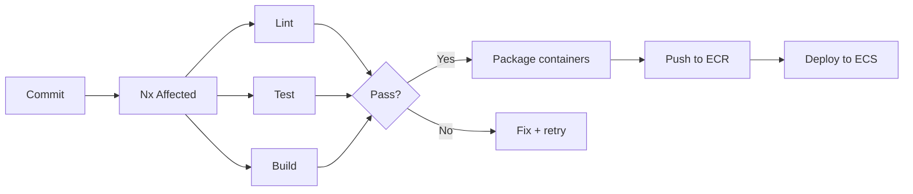

## Containerization strategy

Each application in the monorepo is containerized with a purpose-built Docker image optimized for its runtime.

<Cards>
  <Card title="Portal SPA" icon="browser">
    **Base:** `nginx:stable`
    Copies the built SPA from `dist/apps/portal` into Nginx's HTML directory with a custom `nginx-spa.conf` for client-side routing.
  </Card>
  <Card title="Third-Party Network" icon="browser">
    **Base:** `nginx:stable`
    Same pattern as Portal -- static SPA served via Nginx with SPA-friendly routing config.
  </Card>
  <Card title="Company API" icon="server">
    **Base:** `eclipse-temurin:17-jdk-jammy`
    Spring Boot JAR with a dedicated `spring` user for security. Supports remote debugging via JDWP on port 5005.
  </Card>
  <Card title="OAuth JWT Generator" icon="key">
    **Base:** `node:16.20.2-bookworm-slim`
    Lightweight Node.js container that runs the built output directly. Exposes port 3000.
  </Card>
  <Card title="KM Docs Lambda" icon="function">
    **Base:** `public.ecr.aws/lambda/python:3.9`
    AWS Lambda Python runtime with pip dependencies. Invoked via the `app.handler` entrypoint.
  </Card>
  <Card title="Prometheus" icon="chart-line">
    **Base:** `prom/prometheus`
    Custom `prometheus.yml` configuration baked into the image.
  </Card>
</Cards>

---

## Architecture overview



---

## CI/CD pipeline

The CI pipeline automates the path from commit to deployment.



### CI workflow details

<Steps>
  <Step title="Trigger">
    Runs on pushes to `main` and on all pull requests.
  </Step>
  <Step title="Nx Cloud distribution">
    Starts a distributed CI run with 3 Linux agents via `nx start-ci-run --distribute-on="3 linux-medium-js"`.
  </Step>
  <Step title="Dependency install">
    Uses Node.js 20 with npm caching. Runs `npm ci --legacy-peer-deps`.
  </Step>
  <Step title="Affected analysis">
    `nrwl/nx-set-shas@v4` computes the base SHA so `nx affected` only processes changed projects.
  </Step>
  <Step title="Lint, test, build">
    `npx nx affected -t lint test build` runs all three tasks in parallel across the agent pool.
  </Step>
  <Step title="Self-healing">
    `npx nx fix-ci` runs unconditionally to suggest automated fixes for common CI failures.
  </Step>
</Steps>

---

## Environment configuration

### Spring Boot profiles

The Company API uses Spring profiles to manage environment-specific configuration:

| Profile | Use case |
| :--- | :--- |
| `docker-compose` | Local development with docker-compose |
| `dev` | Development environment |
| `staging` | Staging environment |
| `prod` | Production environment |

Set the active profile via the `SPRING_PROFILES_ACTIVE` environment variable:

```bash
SPRING_PROFILES_ACTIVE=docker-compose
```

### Frontend environment variables

Frontend apps use Vite's `import.meta.env` for build-time environment variables. Place local overrides in `.env.local` (not committed to git).

<Note>
  The `babel-plugin-transform-vite-meta-env` plugin ensures `import.meta.env` works in Jest tests that run under Babel rather than Vite.
</Note>

---

## Infrastructure

### AWS services

| Service | Purpose |
| :--- | :--- |
| **ECS (Fargate)** | Container orchestration for all services |
| **ECR** | Private Docker image registry |
| **CloudFront** | CDN for static assets and SPA delivery |
| **WAF** | Web Application Firewall for request filtering |
| **Route 53** | DNS management |
| **S3** | Static asset storage, Lambda artifacts |
| **CloudWatch** | Logs, metrics, and alarms |
| **Lambda** | Serverless functions (KM Docs) |

### Infrastructure as code

Infrastructure is managed with Terraform. Secrets are stored in HashiCorp Vault and injected at deployment time.

---

## Monitoring

### Prometheus

A custom Prometheus instance scrapes metrics from the Company API's Spring Boot Actuator endpoints. The `prometheus.yml` config is baked into the Prometheus Docker image.

### Grafana dashboards

Grafana connects to Prometheus for visualization. Typical dashboards include:

- JVM heap and garbage collection metrics
- HTTP request latency and error rates
- Database connection pool utilization
- Container CPU and memory usage

### CloudWatch

All ECS containers ship logs to CloudWatch. Set up CloudWatch Alarms for critical thresholds (5xx error rate, latency P99, container restarts).

---

## Scaling

<Columns>
  <Column>
    ### Horizontal scaling

    ECS services use target-tracking autoscaling based on CPU and memory utilization. Scaling policies are defined per service.
  </Column>
  <Column>
    ### Load balancing

    The Application Load Balancer distributes traffic across ECS tasks with health-check-based routing. Unhealthy tasks are automatically deregistered.
  </Column>
</Columns>

### CloudFront caching

Static SPA assets are served through CloudFront with aggressive cache headers. Cache invalidation runs as part of the deployment pipeline when frontend assets change.

---

## Security hardening

<AccordionGroup>
  <Accordion title="TLS everywhere">
    All traffic is encrypted in transit. CloudFront terminates TLS at the edge, and internal communication between ALB and ECS uses HTTPS.
  </Accordion>
  <Accordion title="Security groups">
    ECS services run in private subnets. Only the ALB is internet-facing. Security groups restrict traffic to known ports and source ranges.
  </Accordion>
  <Accordion title="Secrets management">
    Secrets (API keys, database credentials, JWT signing keys) are stored in HashiCorp Vault and injected as environment variables at deploy time. No secrets are committed to the repository.
  </Accordion>
  <Accordion title="Container security">
    The Company API runs as a non-root `spring` user. Docker images use minimal base images to reduce the attack surface.
  </Accordion>
  <Accordion title="WAF rules">
    AWS WAF protects against common web exploits including SQL injection, XSS, and rate limiting. Custom rules block known malicious patterns.
  </Accordion>
  <Accordion title="HIPAA controls">
    The platform handles healthcare data and follows HIPAA-aligned security controls including audit logging, access controls, and encryption at rest.
  </Accordion>
</AccordionGroup>

---

## Rollback procedures

If a deployment causes issues, you can roll back by redeploying the previous ECS task definition revision:

1. Identify the last known good task definition in the ECS console or via the AWS CLI.
2. Update the ECS service to use the previous task definition revision.
3. Monitor health checks to confirm the rollback is healthy.

For frontend deployments, CloudFront serves cached assets. Invalidate the cache only after confirming the new version is stable.

---

## Health checks

Each service exposes a health check endpoint:

| Service | Endpoint | Protocol |
| :--- | :--- | :--- |
| Portal / TPN | `/` (Nginx returns 200) | HTTP |
| Company API | `/actuator/health` | HTTP |
| OAuth JWT Generator | `/health` | HTTP |

The ALB uses these endpoints to determine task health. Unhealthy tasks are replaced automatically by ECS.

---

## Disaster recovery

- **Database backups** -- CockroachDB provides built-in replication and backup. Automated backups run on a schedule.
- **S3 versioning** -- Bucket versioning is enabled for critical assets.
- **Multi-AZ** -- ECS tasks are distributed across multiple availability zones.
- **Infrastructure as code** -- Terraform state enables full environment recreation.

---

## Local development with docker-compose

The `apps/company-api/docker-compose.yml` spins up the full backend stack locally:

```bash
cd apps/company-api
docker-compose up
```

This starts:

| Service | Port | Purpose |
| :--- | :--- | :--- |
| Company API | 8080 | Spring Boot application |
| CockroachDB | 26257 / 8081 | Database (insecure single-node) |
| OpenSearch | 9200 | Search engine |
| RocketChat | 3000 | Chat integration (optional) |
| MongoDB | 27017 | RocketChat backing store |

<Tip>
  To connect the frontend to the local API, set the API base URL to `http://localhost:8080` in your `.env.local` file.
</Tip>
