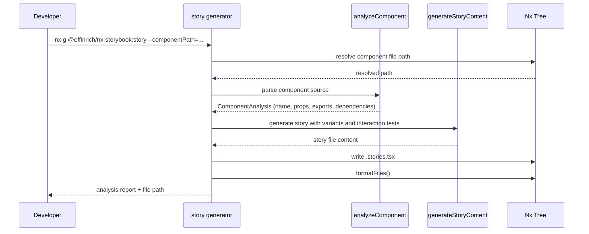
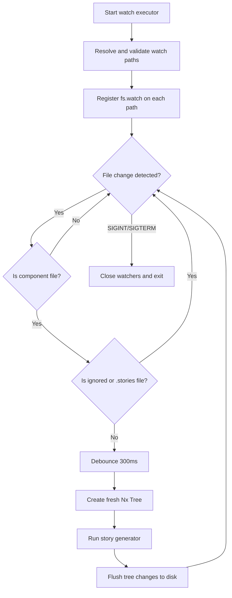
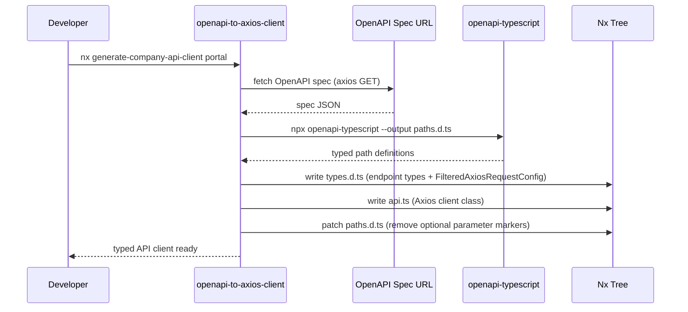

## Nx workspace configuration

The monorepo is powered by [Nx](https://nx.dev) with distributed caching via Nx Cloud. The workspace configuration in `nx.json` defines how projects build, test, and lint.

### Target defaults

Target defaults ensure consistent behavior across all projects without per-project configuration:

| Target | Depends on | Inputs |
| :--- | :--- | :--- |
| `build` | `^build` (upstream libs first) | `production`, `^production` |
| `test` | -- | `default`, `^production`, `jest.preset.js` |
| `lint` | -- | `default`, `.eslintrc.json` |
| `e2e` | -- | `default`, `^production` |
| `build-storybook` | -- | `default`, `^production`, `.storybook/**/*` |
| `@nx/vite:test` | -- | `default`, `^production` |

### Named inputs

Named inputs let you define reusable file sets that determine cache invalidation:

- **default** -- all project files plus `sharedGlobals`
- **sharedGlobals** -- `babel.config.json` at the workspace root
- **production** -- everything in `default` minus test files, spec configs, stories, and Storybook config

### Plugins

Three Nx plugins are registered:

- `@nxrocks/nx-spring-boot` -- Spring Boot lifecycle tasks for the Company API
- `@nx/storybook/plugin` -- auto-infers `serve:storybook`, `build:storybook`, `test:storybook`, and `static:storybook` targets
- `@nx/eslint/plugin` -- adds an `eslint:lint` target to every project

### Generator presets

Default generator options are configured so you do not have to pass flags repeatedly:

```json
{
  "@nx/react": {
    "application": { "style": "@emotion/styled", "linter": "eslint", "bundler": "webpack", "babel": true },
    "component": { "style": "@emotion/styled" },
    "library": { "style": "@emotion/styled", "linter": "eslint", "unitTestRunner": "jest" }
  }
}
```

---

## @effinrich/nx-storybook plugin

A companion plugin for `@nx/storybook` that handles the **content** side — auto-generating `.stories.tsx` and `.ct.tsx` files from component analysis, while `@nx/storybook` handles the infrastructure (config scaffolding, serving, building, migrations). Located in `tools/forgekit-nx-storybook/`.

### Generators

<Tabs>
  <Tab title="init">
    Runs when you install the plugin via `nx add @effinrich/nx-storybook`. It checks for `@nx/storybook`, offers to install it if missing, ensures Storybook core dependencies are present, and prints available commands.

    ```bash
    npx nx g @effinrich/nx-storybook:init
    ```
  </Tab>
  <Tab title="story">
    Generates a single Storybook story file for a React component. It analyzes the component's props (including Chakra UI, React Router, and React Query usage), generates variants for `size`, `variant`, `colorPalette`, and `disabled` props, and optionally includes interaction tests.

    ```bash
    npx nx g @effinrich/nx-storybook:story --componentPath=libs/shared/ui/src/lib/button/button.tsx
    ```

    Options: `--skipInteractionTests`, `--overwrite`, `--dryRun`, `--storyTitle`, `--project`
  </Tab>
  <Tab title="stories">
    Bulk generator that scans an entire project and generates stories for every component that does not already have one. Produces a coverage report with a letter grade (A through F).

    ```bash
    npx nx g @effinrich/nx-storybook:stories --project=shared-ui
    ```

    Options: `--skipInteractionTests`, `--overwrite`, `--dryRun`, `--includeA11y`, `--includeComponentTests`
  </Tab>
  <Tab title="component-test">
    Generates a co-located Playwright component test (`.ct.tsx`) that mounts the component using `@playwright/experimental-ct-react`, tests rendering, visual snapshots, interactions, and accessibility.

    ```bash
    npx nx g @effinrich/nx-storybook:component-test --componentPath=libs/shared/ui/src/lib/button/button.tsx
    ```

    Options: `--overwrite`, `--dryRun`
  </Tab>
</Tabs>

### Story generator sequence



### Watch executor

The `watch` executor monitors component directories for file changes and auto-generates or updates stories with configurable debouncing (default 300 ms).



The executor skips non-component files, ignores spec/test/stories/style files and `index.ts`, and prevents recursive triggering on story files.

---

## OpenAPI client generator

The workspace generator at `tools/generators/openapi-to-axios-client/` fetches an OpenAPI spec and produces a fully typed API client.

### What it generates

For each endpoint in the spec, the generator creates three files:

1. **`paths.d.ts`** -- typed path definitions via `openapi-typescript`
2. **`types.d.ts`** -- endpoint-specific request/response types with `FilteredAxiosRequestConfig`
3. **`api.ts`** -- an Axios-backed API class with typed methods for every endpoint and HTTP verb

### Usage

```bash
# Generate from the dev environment
npx nx generate-company-api-client portal

# Generate from localhost
npx nx generate-company-api-client-local portal
```

### Generator sequence



---

## Build orchestration and scripts

All tasks run from the workspace root. Key scripts in `package.json`:

| Command | What it does |
| :--- | :--- |
| `npm start` | Serves the default project (portal) on port 4200 |
| `npm run build:portal` | Builds the portal app to `dist/apps/portal` |
| `npm run build:ui` | Builds the shared UI library |
| `npm run affected:test` | Runs tests only for projects affected by your changes |
| `npm run affected:lint` | Lints only affected projects |
| `npm run check-types:all` | Type-checks every project in the workspace |
| `npm run chromatic` | Runs Chromatic visual regression (only changed, debug mode) |
| `npm run theme` | Generates Chakra UI theme types |

<Tip>
  Use `nx affected` commands during development to avoid running tasks for the entire workspace. Nx computes the dependency graph and only processes what changed.
</Tip>

---

## ESLint configuration

The root `.eslintrc.json` extends multiple plugin configurations and enforces strict rules across the workspace.

### Key rule groups

<AccordionGroup>
  <Accordion title="TypeScript">
    - `@typescript-eslint/no-explicit-any`: **error** -- no `any` types allowed
    - `@typescript-eslint/no-unused-vars`: **warn**
    - `@typescript-eslint/no-empty-interface`: **error**
    - `@typescript-eslint/no-extra-semi`: **error**
  </Accordion>
  <Accordion title="React and hooks">
    - `react-hooks/rules-of-hooks`: **error**
    - `react-hooks/exhaustive-deps`: **error** with dangerous autofix enabled
    - `react/no-multi-comp`: **warn** -- prefer one component per file
    - `react/no-danger`: **error**
    - `react/jsx-no-target-blank`: **error**
    - `react/destructuring-assignment`: **warn** (always)
    - `react/sort-prop-types`: **warn** (required first, callbacks last)
  </Accordion>
  <Accordion title="Accessibility and Storybook">
    - `plugin:jsx-a11y/recommended` -- enforces accessible JSX patterns
    - `plugin:storybook/recommended` -- Storybook-specific rules
    - `plugin:testing-library/react` -- Testing Library best practices
    - `plugin:@tanstack/eslint-plugin-query/recommended` -- React Query patterns
  </Accordion>
  <Accordion title="Import sorting">
    `simple-import-sort/imports` enforces a specific import order:
    1. Side-effect imports
    2. React and external packages (`^react`, `^@?\w`)
    3. Internal aliases (`@redesignhealth/*`, `components`, `libs`, etc.)
    4. Parent imports (`../`)
    5. Sibling imports (`./`)
    6. CSS imports
  </Accordion>
  <Accordion title="Module boundaries">
    `@nx/enforce-module-boundaries` prevents illegal cross-library imports:
    - **scope:shared** can only depend on **scope:shared**
    - **scope:portal** can depend on **scope:portal**, **scope:shared**, and **scope:rocketchat-poc**
    - **scope:oauth-jwt-generator** can depend on **scope:oauth-jwt-generator** and **scope:shared**
  </Accordion>
</AccordionGroup>

### Other notable rules

- `no-console`: **warn** -- avoid console statements in production code
- `unicorn/filename-case`: **warn** -- kebab-case filenames required
- `react/jsx-curly-brace-presence`: **warn** -- no unnecessary curly braces in JSX

---

## Prettier configuration

Prettier runs with the following settings (`.prettierrc`):

```json
{
  "tabWidth": 2,
  "singleQuote": true,
  "jsxSingleQuote": false,
  "semi": false,
  "trailingComma": "none",
  "arrowParens": "avoid"
}
```

<Note>
  `lint-staged` runs both ESLint and Prettier on staged `*.ts`, `*.tsx`, `*.js`, and `*.jsx` files before each commit.
</Note>

---

## Storybook integration

Storybook is configured for two UI library projects:

| Project | Serve | Build | Test |
| :--- | :--- | :--- | :--- |
| `shared-ui` | `npm run storybook` | `npm run build-storybook` | `npm run test-storybook:shared-ui` |
| `portal-ui` | `npm run storybook-portal-ui` | `npm run build-storybook-portal-ui` | `npm run test-storybook:portal-ui` |

Run all Storybooks simultaneously:

```bash
npm run storybook-all
```

The `@nx/storybook/plugin` auto-infers `serve:storybook`, `build:storybook`, `test:storybook`, and `static:storybook` targets for any project with a `.storybook` directory.

---

## VS Code extensions

The workspace recommends these extensions in `.vscode/extensions.json`:

| Extension | Purpose |
| :--- | :--- |
| `nrwl.angular-console` | Nx Console -- run tasks, visualize graphs |
| `esbenp.prettier-vscode` | Prettier formatting |
| `firsttris.vscode-jest-runner` | Run Jest tests from the editor |
| `dbaeumer.vscode-eslint` | ESLint integration |
| `ms-python.autopep8` | Python formatting (KM Docs Lambda) |
| `ms-playwright.playwright` | Playwright test runner |

<Warning>
  You must select the workspace TypeScript version, not VS Code's bundled version. Open any `.ts` file, press `Cmd+Shift+P`, search for "TypeScript: Select TypeScript Version", and choose "Use Workspace Version".
</Warning>

---

## Path aliases

TypeScript path aliases in `tsconfig.base.json` enable clean imports across the monorepo. Key aliases include:

| Alias | Target |
| :--- | :--- |
| `@redesignhealth/ui` | `libs/shared/ui/src/index.ts` |
| `@redesignhealth/portal/data-assets` | `libs/portal/data-assets/src/index.ts` |
| `@redesignhealth/portal/features/*` | `libs/portal/features/*/src/index.ts` |
| `@redesignhealth/portal/ui` | `libs/portal/ui/src/index.ts` |
| `@redesignhealth/hooks` | `libs/shared/hooks/src/index.ts` |
| `@redesignhealth/analytics` | `libs/shared/analytics/src/index.ts` |
| `@redesignhealth/shared-utils` | `libs/shared/utils/src/index.ts` |
| `@redesignhealth/third-party-network/*` | `libs/third-party-network/*/src/index.ts` |

<Tip>
  When you generate a new library with Nx, the path alias is automatically added to `tsconfig.base.json`. You rarely need to edit it manually.
</Tip>
