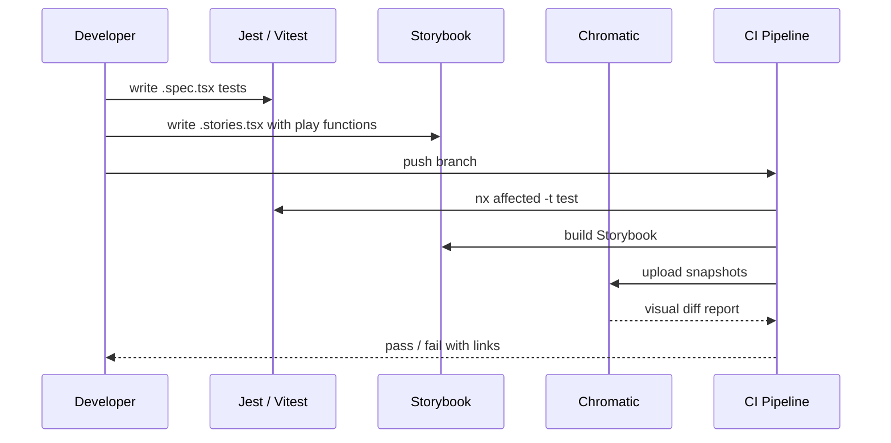

## Multi-layered testing approach

The monorepo uses a layered testing strategy to catch issues at every level -- from isolated unit tests to visual regression and accessibility audits.

| Layer | Tool | Scope |
| :--- | :--- | :--- |
| Unit / integration | Jest, Vitest | Component logic, hooks, utilities |
| Component | @testing-library/react | DOM rendering, user interactions |
| Visual regression | Chromatic + Storybook | Pixel-level UI diffs |
| Interaction | Storybook play functions | Multi-step user flows in stories |
| Accessibility | jest-axe, @storybook/addon-a11y | WCAG 2.1 AA compliance |
| Playwright component | @playwright/experimental-ct-react | Cross-browser component mounting |
| E2E | Playwright | Full application flows |



---

## Jest configuration

Jest is the primary test runner for most projects. The global preset at `jest.preset.js` extends `@nx/jest/preset` with these additions:

- **Transform** -- CSS, SVG, PNG, and HTML files go through `@nx/react/plugins/jest`; TypeScript and JavaScript use `babel-jest` with `@nx/react/babel` and `babel-plugin-transform-vite-meta-env`
- **Module file extensions** -- `ts`, `tsx`, `js`, `jsx`
- **Module name mapping** -- handles Vite's `?raw` file imports

### Global setup

The `jest.setup.js` file runs before every test suite:

```js
import '@testing-library/jest-dom'

// Polyfill TextEncoder/TextDecoder for JSDOM
import { TextEncoder, TextDecoder } from 'util'
Object.assign(global, { TextDecoder, TextEncoder })
```

This gives you access to matchers like `toBeInTheDocument()`, `toHaveAttribute()`, and `toBeVisible()` without importing them in each test.

### Per-project configuration

Each project has its own `jest.config.ts` that extends the preset and sets project-specific options like `displayName`, `coverageDirectory`, and `setupFilesAfterSetup`.

---

## Vitest configuration

Projects built with Vite use Vitest instead of Jest. The `vitest.setup.ts` file at the workspace root:

- Extends `expect` with `@testing-library/jest-dom` matchers
- Mocks `window.matchMedia` globally (required for Chakra UI components)

```ts
import matchers from '@testing-library/jest-dom/matchers'
import { expect, vi } from 'vitest'

vi.stubGlobal('matchMedia', matchMediaMock)
expect.extend(matchers)
```

<Note>
  Both Jest and Vitest setups provide the same `@testing-library/jest-dom` matchers, so your test assertions work identically regardless of the runner.
</Note>

---

## Storybook and Chromatic for visual regression

### Storybook interaction tests

Every UI component should have a `.stories.tsx` file. Use Storybook's `play` function for interaction testing:

```tsx
export const SubmittedForm: Story = {
  play: async ({ canvasElement, step }) => {
    const canvas = within(canvasElement)
    await step('Submit the form', async () => {
      await userEvent.type(canvas.getByTestId('email'), 'user@example.com')
      await userEvent.click(canvas.getByRole('button'))
    })
    await expect(canvas.getByText('Success')).toBeInTheDocument()
  },
}
```

### Chromatic visual regression

Chromatic runs on every push and captures screenshots of all stories. The CI workflow:

1. Checks out the repo with full history (`fetch-depth: 0`)
2. Installs dependencies
3. Runs `chromaui/action@latest` with the `CHROMATIC_PROJECT_TOKEN` secret

```bash
# Run locally
npm run chromatic
```

<Warning>
  UI changes in `type:ui` projects trigger Chromatic. PRs cannot merge until visual changes are accepted in the Chromatic dashboard.
</Warning>

### Storybook test runner

A separate CI workflow runs Storybook interaction tests using a Playwright container:

```bash
npm run test-storybook:shared-ui
npm run test-storybook:portal-ui
```

---

## Accessibility testing

### In Storybook

The `@storybook/addon-a11y` addon runs axe-core checks on every story in the Storybook UI. Violations are displayed in the Accessibility panel.

### In unit tests

Use `jest-axe` for programmatic accessibility checks:

```tsx
import { axe, toHaveNoViolations } from 'jest-axe'

expect.extend(toHaveNoViolations)

it('should have no accessibility violations', async () => {
  const { container } = render(<MyComponent />)
  const results = await axe(container)
  expect(results).toHaveNoViolations()
})
```

### In the forgekit plugin

The `stories` generator can include accessibility tests when `--includeA11y` is enabled (on by default). The `component-test` generator produces Playwright tests that include an a11y assertion.

---

## Component testing strategies

### Colocated test files

Test files live next to the components they test using the `*.spec.tsx` naming convention:

```
libs/shared/ui/src/lib/button/
  button.tsx
  button.spec.tsx
  button.stories.tsx
```

### Testing with @testing-library/react

```tsx
import { render, screen } from '@testing-library/react'
import userEvent from '@testing-library/user-event'

import { Button } from './button'

describe('Button', () => {
  it('should call onClick when clicked', async () => {
    const handleClick = jest.fn()
    render(<Button onClick={handleClick}>Click me</Button>)

    await userEvent.click(screen.getByRole('button'))
    expect(handleClick).toHaveBeenCalledTimes(1)
  })
})
```

### Playwright component tests

The `forgekit-nx-storybook:component-test` generator creates `.ct.tsx` files that mount components directly using `@playwright/experimental-ct-react` for cross-browser testing with visual snapshots.

---

## API and data layer testing

### React Query test utilities

Wrap components that use React Query hooks in a `QueryClientProvider` with a test-specific client:

```tsx
import { QueryClient, QueryClientProvider } from '@tanstack/react-query'

function createTestQueryClient() {
  return new QueryClient({
    defaultOptions: {
      queries: { retry: false },
    },
  })
}

function renderWithQuery(ui: React.ReactElement) {
  const client = createTestQueryClient()
  return render(
    <QueryClientProvider client={client}>{ui}</QueryClientProvider>
  )
}
```

### Mock fixtures

The `@redesignhealth/shared-utils-jest` library provides shared test utilities and fixtures. Use `@faker-js/faker` for generating realistic test data.

---

## Mocking strategies

<Tabs>
  <Tab title="MSW for Storybook">
    Mock Service Worker intercepts network requests at the service worker level. The `msw-storybook-addon` integrates MSW with Storybook so stories can declare their own mock handlers.

    ```tsx
    export const WithData: Story = {
      parameters: {
        msw: {
          handlers: [
            http.get('/api/users', () => {
              return HttpResponse.json([{ id: 1, name: 'Jane' }])
            }),
          ],
        },
      },
    }
    ```
  </Tab>
  <Tab title="Jest / Vitest mocks">
    Use `jest.mock()` or `vi.mock()` for module-level mocking. Prefer mocking at the API boundary rather than internal implementation.

    ```tsx
    jest.mock('@redesignhealth/portal/data-assets', () => ({
      useCompanies: jest.fn(() => ({
        data: mockCompanies,
        isLoading: false,
      })),
    }))
    ```
  </Tab>
  <Tab title="Factory functions">
    Create factory functions for complex test data to keep tests readable and maintainable.

    ```tsx
    import { faker } from '@faker-js/faker'

    function createCompany(overrides = {}) {
      return {
        id: faker.string.uuid(),
        name: faker.company.name(),
        status: 'active',
        ...overrides,
      }
    }
    ```
  </Tab>
</Tabs>

---

## CI quality gates

The CI pipeline runs on every push to `main` and on pull requests.

### Pipeline steps

<Steps>
  <Step title="Checkout and distribute">
    The workflow checks out the code, starts Nx Cloud CI run with 3 Linux agents for task distribution.
  </Step>
  <Step title="Install dependencies">
    Runs `npm ci --legacy-peer-deps` with Node.js 20 and caches `node_modules`.
  </Step>
  <Step title="Compute affected">
    Uses `nrwl/nx-set-shas@v4` to determine the base commit for `nx affected`.
  </Step>
  <Step title="Run affected tasks">
    Executes `npx nx affected -t lint test build` -- only projects affected by your changes are processed.
  </Step>
  <Step title="Self-healing">
    `npx nx fix-ci` runs on every pipeline (even on failure) to suggest fixes for common issues.
  </Step>
</Steps>

### Nx Cloud caching

Nx Cloud caches task results remotely. If a task has already been run with the same inputs, the cached result is replayed instantly. This typically cuts CI time by 50-80%.

### Chromatic acceptance

A separate Chromatic workflow runs on every push. Visual changes must be reviewed and accepted in the Chromatic dashboard before the PR can merge.

---

## Spring Boot testing

The Company API (`apps/company-api`) uses standard Spring Boot testing patterns:

| Annotation | Use case |
| :--- | :--- |
| `@WebMvcTest` | Controller layer tests with MockMvc |
| `@DataJpaTest` | Repository layer tests with an in-memory database |
| `@SpringBootTest` | Full integration tests |
| `@MockBean` / Mockito | Service layer mocking |

JUnit 5 is the test framework. Tests follow the `*Test.java` naming convention.

---

## Common commands

| Task | Command |
| :--- | :--- |
| Run all tests | `npm test` |
| Test a specific project | `npx nx test <project-name>` |
| Test in watch mode | `npx nx test <project-name> --watch` |
| Run a specific test | `npx nx test <project-name> --testNamePattern="pattern"` |
| Test affected projects | `npm run affected:test` |
| Storybook tests (shared-ui) | `npm run test-storybook:shared-ui` |
| Storybook tests (portal-ui) | `npm run test-storybook:portal-ui` |
| Chromatic visual regression | `npm run chromatic` |
| Type-check all projects | `npm run check-types:all` |

---

## Troubleshooting

<AccordionGroup>
  <Accordion title="Tests fail with 'TextEncoder is not defined'">
    Ensure your project's Jest config includes `jest.setup.js` in `setupFilesAfterSetup`. The setup file polyfills `TextEncoder` and `TextDecoder` for JSDOM.
  </Accordion>
  <Accordion title="Vitest fails with matchMedia errors">
    Check that `vitest.setup.ts` is referenced in your Vite project's config. The setup file mocks `window.matchMedia`, which Chakra UI components require.
  </Accordion>
  <Accordion title="Storybook interaction tests time out">
    Increase the test timeout in your Storybook test runner config. Also verify that async operations in `play` functions properly `await` each step.
  </Accordion>
  <Accordion title="Chromatic shows unexpected diffs">
    Font loading, animation timing, and viewport differences can cause false positives. Use Chromatic's `ignoreSelectors` or `pauseAnimationAtEnd` options to stabilize flaky snapshots.
  </Accordion>
  <Accordion title="jest-axe violations in Chakra UI components">
    Some Chakra UI components may produce axe warnings for color contrast or missing labels. Ensure you pass `aria-label` or use Chakra's built-in accessibility props. Check the Chakra UI docs for component-specific a11y guidance.
  </Accordion>
  <Accordion title="Nx affected runs more tests than expected">
    Run `npx nx graph` to inspect the dependency graph. A shared library change affects all downstream consumers. You can also check `npx nx show project <name> --web` to see a project's dependencies.
  </Accordion>
</AccordionGroup>
