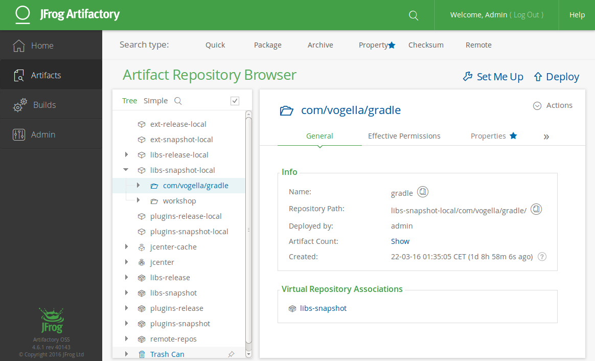

# JFrog Artifactory

JFrog Artifactory is a universal DevOps solution providing end-to-end automation and management of binaries and artifacts through the application delivery process that improves productivity across your development ecosystem.

## Description

**Category:** Artifactory

**Website:**  [JFrog](https://jfrog.com/pricing/)

**License:** [Apache License 2.0](https://github.com/jfrog/terraform-provider-artifactory/blob/master/LICENSE)

**Documentation:** [Guide](https://www.jfrog.com/confluence/display/JFROG/JFrog+Documentation)

**Repository:** [GitHub](https://github.com/jfrog)

## Benefits

* Enables Opcos, vendors, and Redesign Health to build software and deploy the versioned software builds to a central repository housed internally to the OpCo for control in a highly secure manner.
* Provides a central repository for all containter artifacts for Opcos.
* Provides a central repository mirroring all external dependencies with security scans.
* Supports repository mirroring and a local repository for all languages and container types.
* RH can push updates to reference images and containers to their Artifactory (Federated). I.E. Design System and Reference software for security
* Cloud Vendor Agnostic
* Offer is either Managed or Self Hosted based on Opco level of comfort

## Image

