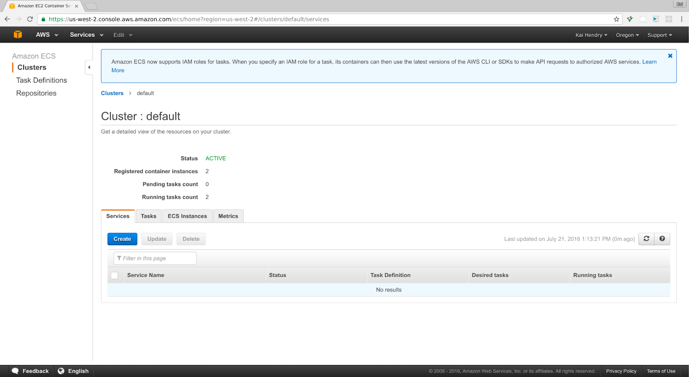

# Amazon Elastic Container Service (ECS)

Amazon Elastic Container Service (ECS) is a fully managed container orchestration service that helps you easily deploy, manage, and scale containerized applications. It deeply integrates with the rest of the AWS platform to provide a secure and easy-to-use solution for running container workloads.

## Description

**Category:** Image Orchestration

**Website:** [AWS ECS](https://aws.amazon.com/ecs/)

**License:** AWS Managed Service

**Documentation:** [Getting Started Guide](https://aws.amazon.com/ecs/getting-started/)

**Repository:** N/A

## Benefits

Amazon ECS provies the following benefits when used as part of the Redesign Platform infrastructure:

* a simple way to deploy applications onto an infrastructure
* simple orchestration to solve the generic use-case for small marketing websites
* ability to automatically scale applications
* standard level of availability and security
* longer term migration path to Amazon Elastic Kubernetes Service (EKS) depending on use case

## Images

