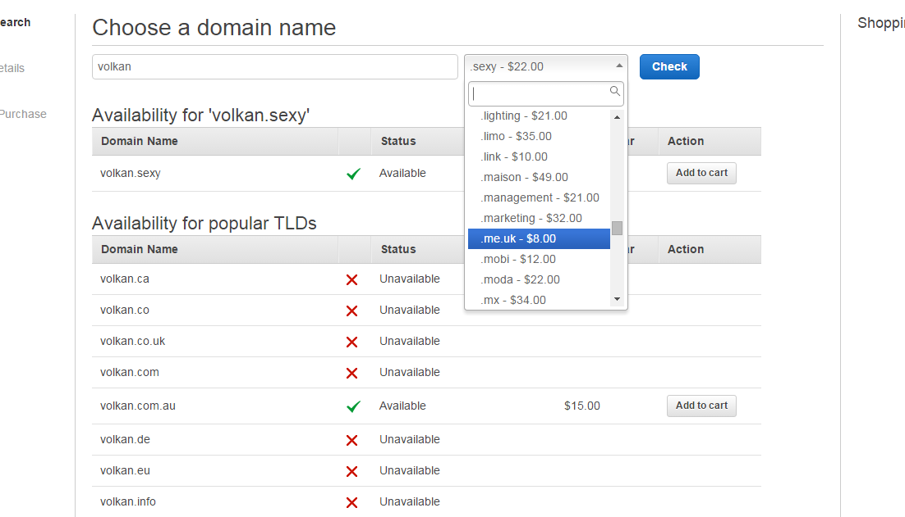

# Amazon Route 53

Amazon Route 53 is a highly available and scalable Domain Name System (DNS) web service. Route 53 connects user requests to internet applications running on AWS or on-premises.

## Description

**Category:** Network Content Delivery

**Website:** [Amazon Route 53](https://aws.amazon.com/route53/)

**License:** AWS Managed Service

**Documentation:** [Amazon Route 53 Developers Guide](https://docs.aws.amazon.com/Route53/latest/DeveloperGuide/Welcome.html)

**Repository:** N/A

## Benefits

AWS Route 53 provides the following benefits when used as part of the Redesign Platform infrastructure:

- a cloud-based edge service that enables complex DNS interoperability
- managed service
- features, such as:
- - DNS failover
- - health check and monitoring
- - Elastic Load Balancing (ELB) integration
- - a private Virtual Private Cloud (VPC)
- ability to leverage interplay with other cloud-based edge components

## Images

