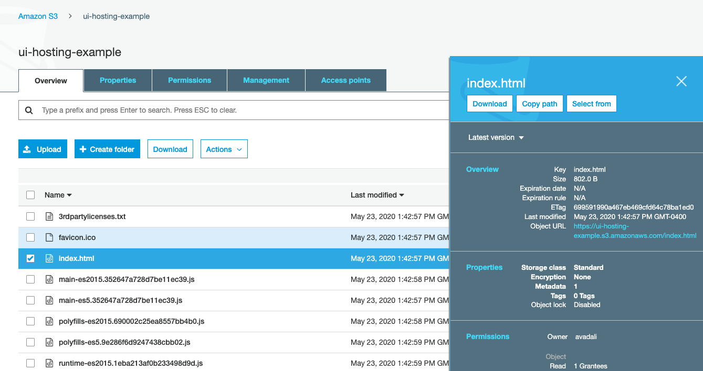

# AWS - Simple Storage Service (S3)

Amazon Simple Storage Service (Amazon S3) is an object storage service offering industry-leading scalability, data availability, security, and performance.

## Description

**Category:** Storage

**Website:** [Amazon S3](https://aws.amazon.com/pm/serv-s3/)

**License:** AWS Managed Service

**Documentation:** [User Guide](https://docs.aws.amazon.com/AmazonS3/latest/userguide/Welcome.html)

**Repository:** N/A

## Benefits

Amazon S3 provides the following benefits when used as part of the Redesign Platform infrastructure:

* a standard offering for general purpose storage that can be used across various open-source tools
* low cost and highly scalable
* a derivative is available on all cloud providers

## Images

