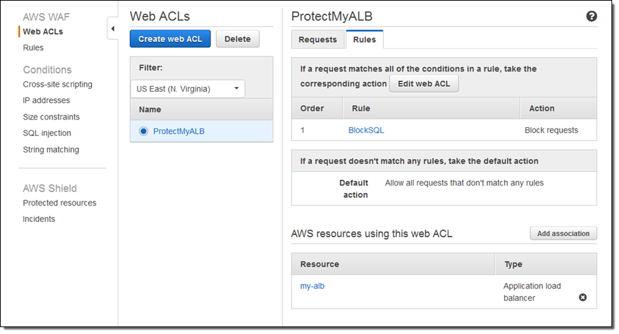

# AWS Web Application Firewall (WAF)

AWS Web Application Firewall (WAF) is a web application firewall that helps protect your web applications and APIs against common web exploits and bots that can affect availability, compromise security, or consume excessive resources.

## Description

**Category:** DDOS Protection

**Website:** [AWS Web Application Firewall](https://aws.amazon.com/waf/)

**License:** AWS Managed Service

**Documentation:** [Developer Guide](https://docs.aws.amazon.com/waf/latest/developerguide/what-is-aws-waf.html)

**Repository:** N/A

## Benefits

AWS WAF provides the following benefits when used as part of the Redesign Platform infrastructure:

- an AWS edge service that can provide Tier 1 Firewall and DDOS protection against components within the stack. This is necessary for compliance with many Security Frameworks
- a managed service
- features, such as:
- - web traffic filtering
- - bot control
- - account takeover fraud prevention
- - real-time visibility and integration with AWS firewall manager
- ability to leverage interplay with other cloud-based edge components

## Images

