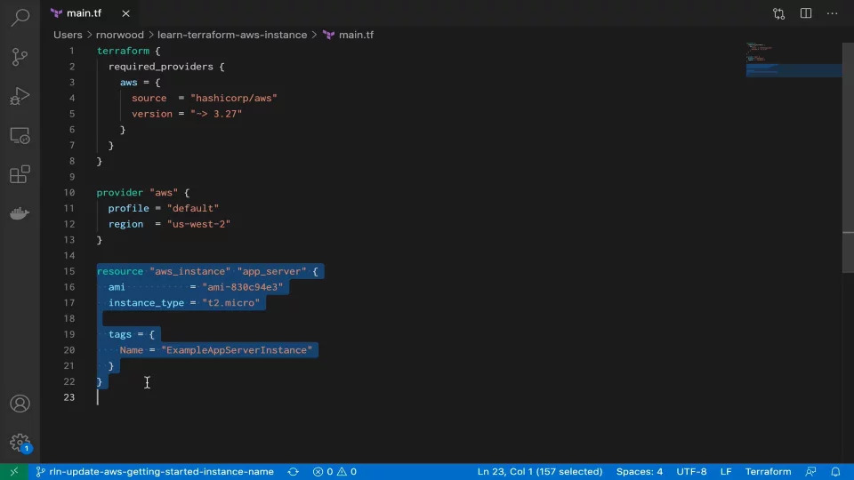

# HashiCorp Terraform

Terraform is an open-source ***infrastructure as code*** software tool that enables you to safely and predictably create, change, and improve infrastructure.

## Description

**Category:** Config Management Infrastructure

**Website:** [TerraWform](https://www.terraform.io/)

**License:** [Mozilla Public License 2.0](https://github.com/hashicorp/terraform/blob/main/LICENSE)

**Documentation:** [Terraform Guide](https://www.terraform.io/intro)

**Repository:** [GitHub](https://github.com/hashicorp/terraform)

## Benefits

Terraform provides the following benefits when used as part of the Redesign Platform:

* an open-source, free tool for confiuration management
* managed and maintained by the Platform team to guarantee OpCos have the latest availalble version
* templates that allow the Platform to:
* * initiate and kick off specific infrastructure choices to size the build out properly for the OpCo
* * centralize and version control an offering for an OpCo that can be redeployed via the Platform UI or forked to provide access to the latest Redesign offering
* modernization of the UI experience to make it simple for:
* * a non-technical user to kick off a build-out
* * more technical users to bypass the UI and use the templates directly

## Images

