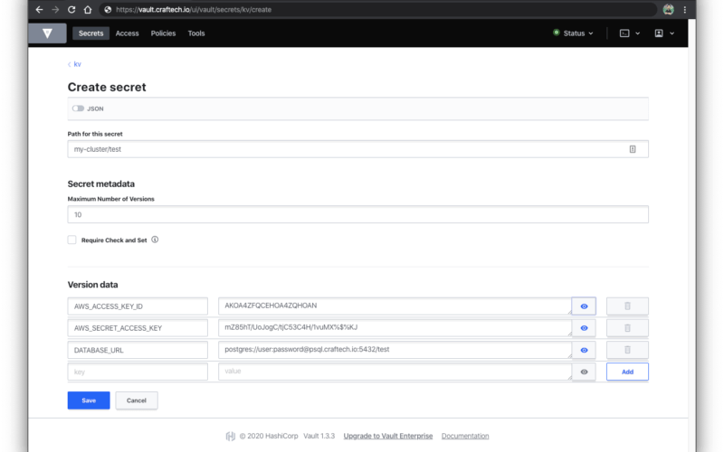

# HashiCorp Vault

HashiCorp Vault provides secure, store and tightly control access to tokens, passwords, certificates, encryption keys for protecting secrets and other sensitive data using a UI, CLI, or HTTP API.

## Description

**Category:** Secured key-value (KV) store

**Website:** [Hasicorp - Vault](https://www.vaultproject.io/)

**License:** [Mozilla Public License 2.0](https://github.com/hashicorp/vault/blob/main/LICENSE)

**Documentation:** [Guide](https://www.vaultproject.io/docs)

**Repository:** [GitHub](https://github.com/hashicorp/vault)

## Benefits

Vault provides the following benefits:

- Industry standard for storing and persisting secure and sensitive data sets, including:
- - Certs
- - Passwords
- - Environment Variables
- An open-source, cloud-agnostic system
- A polyglot SDK that allows for native integration to popular languages and frameworks
- A user-friendly UI that allows non-technical users access to manage and persist data in a very secure way
- Use of a 256-bit [Advanced Encryption Standard (AES)](https://en.wikipedia.org/wiki/Advanced_Encryption_Standard) cipher in the [Galois Counter Mode (GCM)](https://en.wikipedia.org/wiki/Galois/Counter_Mode) with 96-bit nonces
- Both managed and self-hosted solutions

## Images

