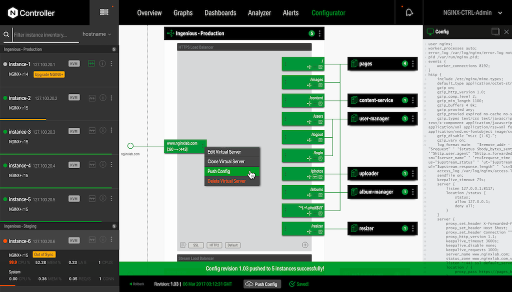

# NGINX - API Gateway/Ingress Gateway

NGINX is open source software for web serving, reverse proxying, caching, load balancing, media streaming, and more.

## Description

**Category:** API Gateway

**Website:** [NGINX](https://www.nginx.com/)

**License:** [BSD-2-Clause](https://github.com/nginx/nginx/blob/master/docs/text/LICENSE)

**Documentation:** [NGINX Diocs](https://docs.nginx.com/)

**Repository:** [GitHub](https://github.com/nginx/nginx)

## Benefits

NGINX provides the following benefits:

* an open-source, free, server and reverse proxy industry standard tool
* highly performant across HTTP and IMAP/POP
* support for Layer 7 features such as load balancing
* operates as the key ingress into the services and software developed
* large pool of online resources about NGINX and easy to hire to support
* low cost to maintain
* easy to use and learn
* native integration with all cloud providers edge service offerings
* managed or self-hosted options

## Images

