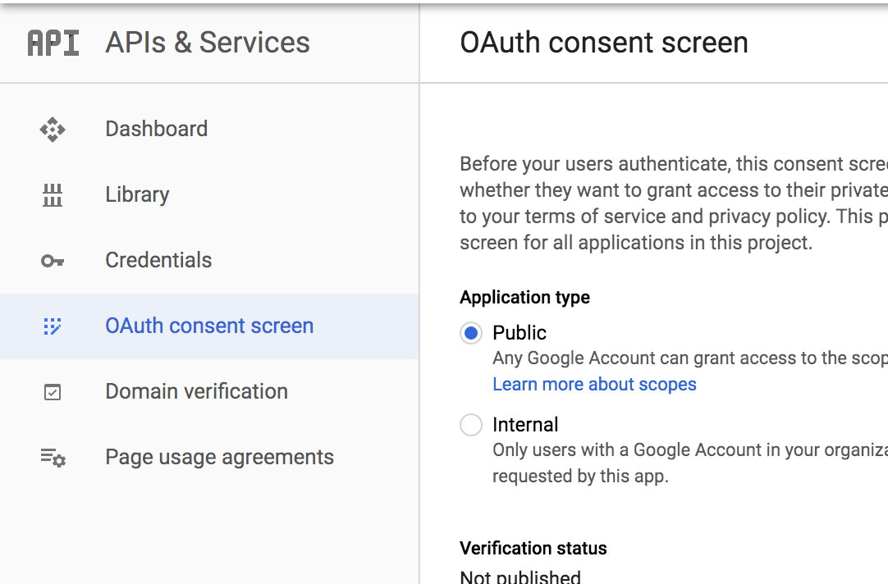

# Oauth/Google - Google + Okta(RH)

Okta is a customizable, secure, and drop-in solution to add authentication and authorization services to your applications. Get scalable authentication built right into your application without the development overhead, security risks, and maintenance that come from building it yourself.

## Description

**Category:** IAM

**Website:** Google MFA Oauth (provided)
Okta (optional)

**License:** [Custom](https://www.okta.com/sites/default/files/MSA-Q1-FY21-Update-Online-Terms.pdf)

**Documentation:** [Guide](https://developer.okta.com/docs/guides/)

**Repository:** [GitHub](https://github.com/okta)

## Features

The Platform uses Google authentication and OAuth in the following ways:

* All users to an infrastructure will first be added to the Google workspace as a standard practice
* For OAuth:
* * The Platform will use Google to authenticate the user against the Google workspace. Doing so allows a no-cost initial entry to getting authentication into the infrastructure and platform resources
* Authentication will be managed from a single location  via Google
* After an OpCo is ready to establish a native CIAM, authentication can be migrated to Okta
* Using Google provides a free, no-effort management for OAuth (Standard - Recommended)
* Okta allows for growth and an advanced management fidelity for future growth (Optional)

## Images

