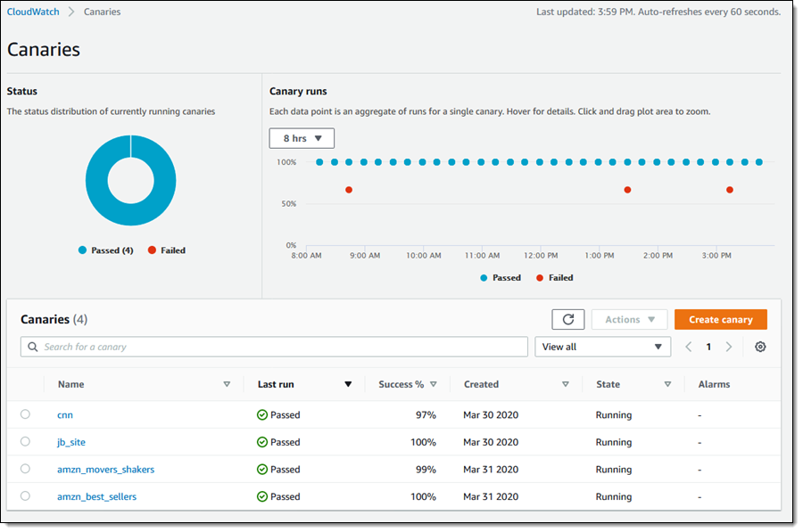

# CloudWatch

Amazon CloudWatch is a monitoring and observability service built for DevOps engineers, developers, site reliability engineers (SREs), IT managers, and product owners.

CloudWatch provides you with data and actionable insights to monitor your applications, respond to system-wide performance changes, and optimize resource utilization.

CloudWatch collects monitoring and operational data in the form of logs, metrics, and events.

## Description

**Category:** Logging

**Website:** [CloudWatch](https://aws.amazon.com/cloudwatch/)

**License:** AWS Managed Service

**Documentation:** [CloudWatch Guide](https://aws.amazon.com/cloudwatch/getting-started/)

**Repository:** N/A

## Benefits

CloudWatch provides the following benefits when used as part of the Redesign Platform infrastructure:

* the recommended first offering for logging and events
* easy integration with other AWS solutions
* an AWS-centric solution for capturing logs and providing an interface to view
* a secondary offering of ELK will be provided for more advanced abilities

## Images

