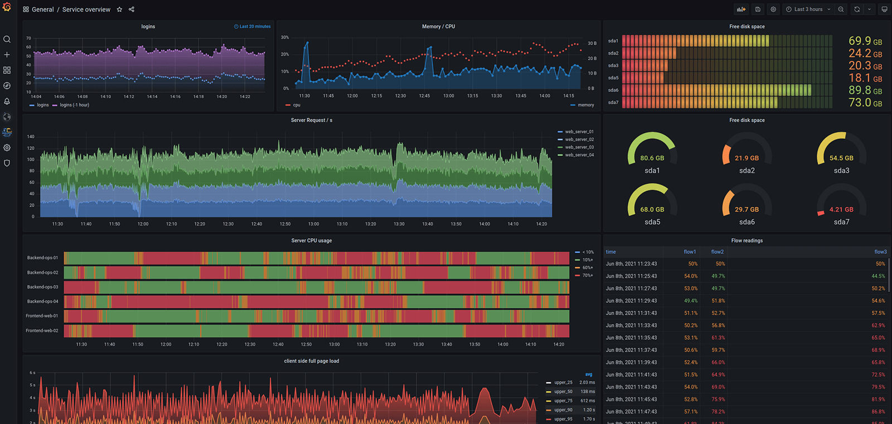

# Grafana

Grafana is the open source analytics and monitoring solution for every database.

## Description

**Category:**

**Website:** [Grafana](https://grafana.com/)

**License:** [GNU affero GPL 3.0](https://github.com/grafana/grafana/blob/main/LICENSE)

**Documentation:** [Guide](https://grafana.com/docs/)[Github]

**Repository:** [GitHub](https://github.com/grafana/grafana)

## Benefits

* Grafana is the most popular, and heavily used customized dashboards/visualization software that enables a federated datasource of APM solutions
* It is completely cloud agnostic and implements a scraping mechanism to reduce the load
* Grafana is easy to use and has a large community of developers who have used or are familiar with it
* Grafana has plugins to many leading Pager-Duty and alerting systems
* Grafana  is free to use and open source with a low footprint to manage if any
* Offer is either Managed or Self Hosted based on Opco level of comfort

## Images

