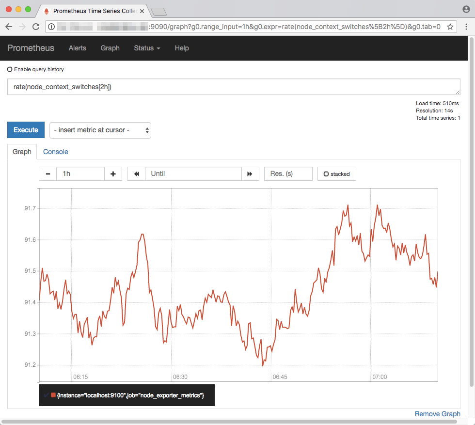

# Prometheus

Prometheus, a Cloud Native Computing Foundation project, is a systems and service monitoring system. It collects metrics from configured targets at given intervals, evaluates rule expressions, displays the results, and can trigger alerts when specified conditions are observed.

## Description

**Category:** Metrics

**Website:** [Prometheus](https://prometheus.io/)

**License:** [Apache License 2.0](https://github.com/prometheus/prometheus/blob/main/LICENSE)

**Documentation:** [Guide](https://prometheus.io/docs/introduction/overview/)

**Repository:** [GitHub](https://github.com/zaproxy/zaproxy)

## Benefits

* Prometheus is the most popular, and heavily used solution for aggregating metrics as time series database for application and service monitoring
* It is completely cloud agnostic and implements a scraping mechanism to reduce the load
* It follows the Open Telemetry specification
* Most modern and native software frameworks support prometheus natively with many SDK options
* Prometheus has backing by a large community by Cloud Native Cloud Foundation (CNCF)
* Provides very complex features and plugin like alerts, pagerduty and so-on
* Offer is either Managed or Self Hosted based on Opco level of comfort

## Images

