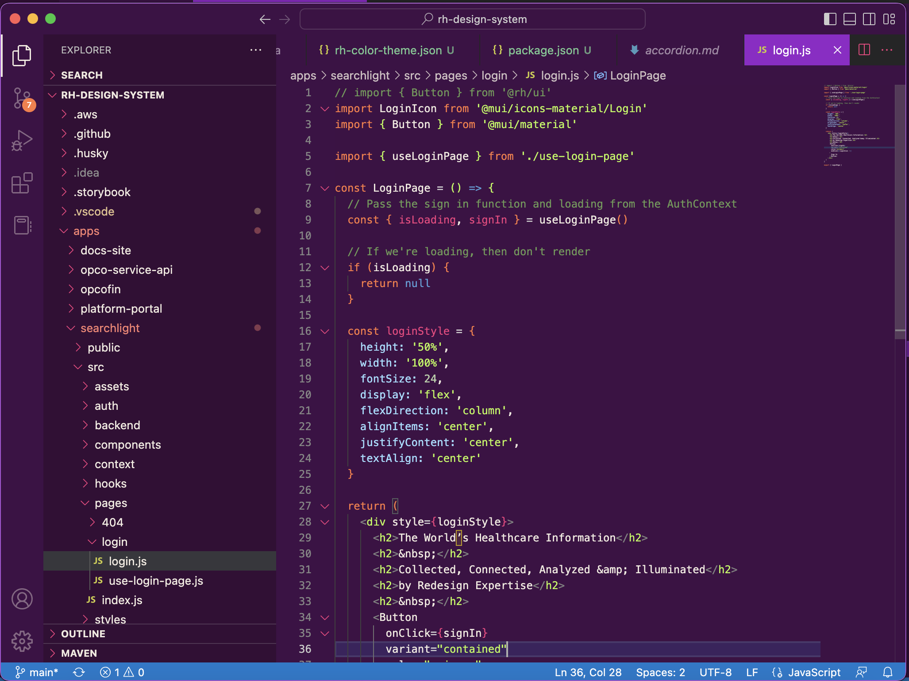

# Redesign Health Visual Studios Code Theme



## How to install
1. Add a symlink to `~/.vscode/extensions`
```bash
$ ln -s /path/to/redesign-health-theme ~/.vscode/extensions/redesign-health-theme
```
2. Open VS Code and hit `cmd` + `shift` + `p`
3. Type `Color Theme` and select `Preferences: Color Theme`
4. Select `Redesign Health`
5. 🎉

## Developing improvements for the theme
Not all the colors have been updated and contributions are welcomed 🎨 

The best workflow I've found is copying the theme into your `settings.json` file, making some changes, and then updating this repo.

Here's how we do that
1. hit `cmd` + `shift` + `p` 
2. Type `User Settings` and select `Preferences: User Settings (JSON)`
3. Add a section for `"workbench.colorCustomizations"` and `"editor.tokenColorCustomizations"`
4. hit `cmd` + `shift` + `p`
5. Type `Generate Color Theme` and select `Developer: Generate Color Theme From Current Settings`
6. Copy/Paste `colors` section into `"workbench.colorCustomizations"`
7. Copy/Paste `tokenColors` section into `"editor.tokenColorCustomizations": { "textMateRules": [] }`
8. Your `settings.json` should look like this
```json
{
  "workbench.colorCustomizations": {
	"focusBorder": "#B9F94E",
    ...
  },
  "editor.tokenColorCustomizations": {
    "textMateRules": [
      {
        "scope": "emphasis",
        "settings": {
          "fontStyle": "italic"
        },
      },
      ...
    ]
  }
		
```

## More resources
* [Redesign Health Brand Figma](https://www.figma.com/file/0KgTXLaA268QPG3xVW84hE/RH-Internal-Brand-Requests?node-id=305%3A353&t=LC6UCrQmBzSt8dum-1)
* [How to publish a theme](https://code.visualstudio.com/api/extension-guides/color-theme#create-a-new-color-theme)
* [Theme attribute names](https://code.visualstudio.com/api/references/theme-color)
* [How to look up what theme attribute is being used](https://code.visualstudio.com/api/language-extensions/syntax-highlight-guide#scope-inspector)